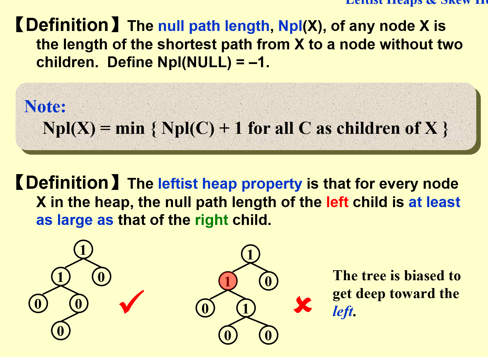
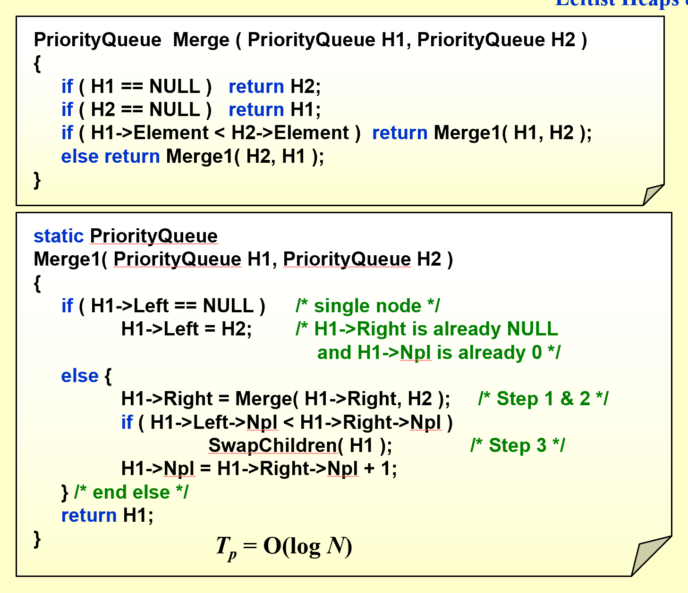
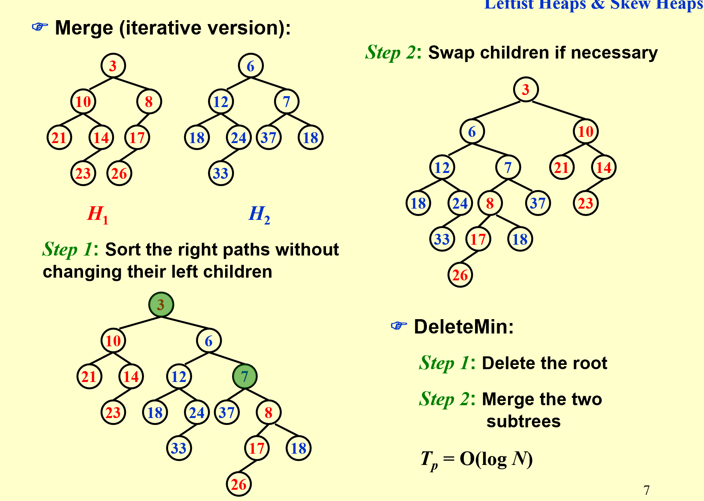

# Advanced Data Structure
## Leftist Heap
### Definition

```c++
struct LeftistHeapNode {
    ElementType val;
    int Npl;
    LeftistHeapNode * ls, * rs;
};
```
### Properties
!!! note
    1. 当前节点的Npl等于其右孩子节点的Npl+1
    2. 若 $Npl_i=N$, 则以i为根的字数至少是一个N+1层的完美二叉树，至少有 $2^{N+1}-1$ 个节点
### Methodology
#### Merge
思路:先维护堆的性质，在回溯时维护左偏性质，所以实际上它是一个先自上而下再自下而上的过程
##### 递归版
1. 递归式先比较当前两个待合并子树的根结点的键值，选择较小（较大）的那个作为根结点，其左子树依然为左子树，右子树更新为「右子树和另一个待合并子树的合并结果」
2. 在递归地更新完后，我们需要检查左子树和右子树是否满足 $Npl_{left\ child} > Npl_{right\ child}$  的性质，如果不满足，我们则需要交换左右子树来维持性质

##### 迭代版

## Skew Heap
!!! quote
    Wikipedia:[https://en.wikipedia.org/wiki/Skew_heap](https://en.wikipedia.org/wiki/Skew_heap)
思路，依然先维护堆的性质，但这次每次合并操作之后，**无条件地交换左右子树**，这样我们就不需要在回溯的时候才进行左右子树的交换。
## Amortized Analysis for Skew Heaps
