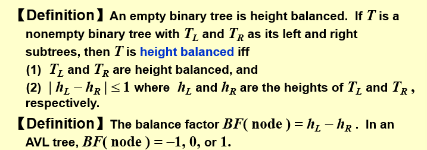
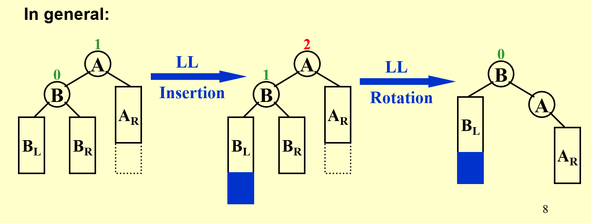
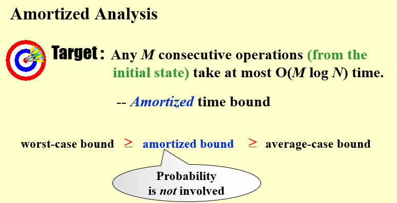

# Advanced Data Structure

## Intro

ADS, 全称为Advanced Data Structure, 浙江大学计科的专业课之一，难度较高

我的老师是 陈昊

!!! quote "参考资料"
    [IsshikiHugh's Notebook](https://isshikihugh.github.io/notebook/)


## Week 1

### AVL Trees

!!! note 
    定义一种相对平衡的树，降低树的高度，加速插入和查找

#### Definition

!!! quote link
    OI Wiki: https://oi-wiki.org/ds/avl/



1. 一个空二叉树是一个AVL树
2. 如果二叉树 $T$ 是一个 AVL 树，则其左右孩子树 $T_l$ 和 $T_r$ 也都应该是 AVL 树，且有 $|h(T_l) - h(T_r)| \leq 1$；

!!! Balance Factor
    一个节点的 **平衡因子(Balance Factor,BF)** 用来描述一个节点的平衡程度，对于节点 $T_p$, 其左子树为 $T_l$, 右子树为 $T_r$, 则:

    $$
       BF(T_p) = h(T_l) - h(T_r) 
    $$

所以上面的第 2 条又可以写成：

- 如果二叉树 $T$ 是一个 AVL 树，则其左右子树 $T_l$ 和 $T_r$ 也都应该是 AVL 树，且有 $BF(T_p) \in \{0, \pm 1\}$；


#### Methodology
> 判断一棵树是否是AVL树，以及如何维护它

1. `trouble maker`  
2. `trouble finder`
3. `RR rotation / LL rotation` 单旋
4. `LR rotation / LR rotation` 双旋

!!! definition 图示
    !!! note "LL | RR"
        
    !!! note "LR | RL"
        
<!-- !!! definition 例子
    !!! note ""
        === "Frame 1"
            下图为一个 AVL 树：

            ```mermaid
            graph TD;
            A(("8, BF=1"))
            B(("4, BF=0"))
            C(("9, BF=0"))
            D(("2, BF=0"))
            E(("6, BF=0"))
            A === B
            A === C
            B === D
            B === E
            ```
        
        === "Frame 2"
            现在我们插入 `5`：

            ```mermaid
            graph TD;
            A(("8, BF=2"))
            B(("4, BF=-1"))
            C(("9, BF=0"))
            D(("2, BF=0"))
            E(("6, BF=1"))
            F(("5, BF=0"))
            A === B
            A === C
            B === D
            B === E
            E === F
            E === NULL
            ``` -->
<!-- 
            我们发现，此时 `8` 的「平衡因子」变成了2，不再符合 AVL 树的要求，而这一切都是 `5` 的插入导致的——于是我们称像这里的 `8` 一样，由于某个点的插入，其「平衡因子」不再符合要求的点，为 Trouble Finder；而像这里的 `5` 一样，导致 Trouble Finder 出现的点，被称之为 Trouble Maker。

    形象地描述这件事就是，在动态插入 `5` 这个过程中，出现了一个 "Trouble"，导致这个树不再是 AVL 树，而 `5` 是这个 "Trouble" 的 "Maker"，`8` 是 "Finder"。 -->

---
#### Analysis


### Splay Trees

> AVL Trees 需要储存 BF，Splay Trees 想在节约 Size 的同时，尽量快


#### Main Idea


#### Methodology
首先我们做一个约定，对于任意一个节点 X，我们记其父节点为 P(Parent)，其父节点的父节点为 G(Grandparent)。

- 当我们访问到某个点 X 时：
    - 如果 P 是根节点，则直接进行一次 [Single Rotation](#avl-trees){target="_blank"}(LL 或者 RR Rotation，将 X 转到根节点；
    - 如果 P 不是根节点：
        - 当情况为 LR / RL 时，进行一次 [LR Rotation 或 RL Rotation](#avl-trees){target="_blank"}，我们称之为 zig-zag；
        - 当情况为 LL / RR 时，进行两次 [Single Rotation](#avl-trees){target="_blank"}，使得 X、P、G 的顺序逆转，像跷跷板一样，我们称之为 zig-zig；
    - 不断对 X 进行 Splay 操作，直到 X 成为根节点；


### Amortized Analysis
>对Splay Trees的分析采用了Amortized Analysis

!!! quote "wiki"
    [Wiki](https://zh.wikipedia.org/wiki/%E5%B9%B3%E6%91%8A%E5%88%86%E6%9E%90): 在计算机科学中，是用于算法分析中的方法，平摊分析常用于分析数据结构（**动态的数据结构**），在使用平摊分析前须知道数据结构各种操作所可能发生的时间，并计算出最坏情况下的操作情况并加以平均，得到操作的平均耗费时间。平摊分析**只能确保最坏情况性能的每次操作耗费的平均时间**，并不能确认平均情况性能。
#### Definition


#### Methodology
!!! definition "Amortized Analysis 的三种方法"
    !!! definition "Aggregate analysis"
        累积连续 M 次操作的代价，再除以 M
        $$
            T_{amortized} = \frac{\sum_i{T_{i}}}{n}
        $$
    !!! definition "Accounting method"
        设 n 次连续操作的 actual cost 是 $c_i$, 找到 $c_i$的平滑上界$\hat{c}_i$ 作为 amortized cost.
        $$
            \hat{c}_i = c_i + credit\\
            \sum_{i=1}^n{\hat{c}_i} = \sum_{i=1}^n{c_i} + CREDIT\\
            T_{amortized} = \frac{\sum_{i=1}^n{\hat{c}_i}}{n} \leq \frac{\sum_{i=1}^n{c_i}}{n}
        $$

    !!! definition "Potential method"
    


    


