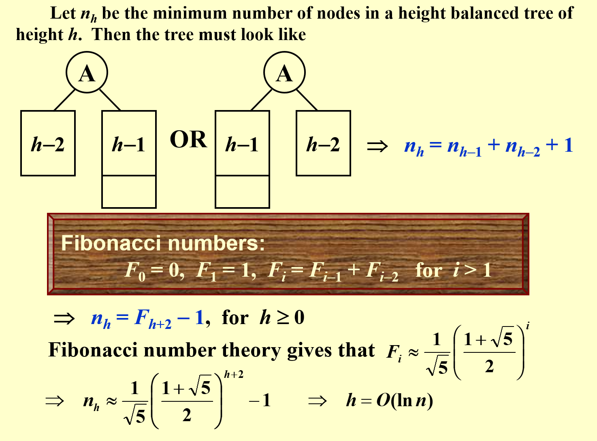

# Advanced Data Structure

## Intro

 ADS, 全称为Advanced Data Structure, 浙江大学计科的专业课之一，难度较高

 我的老师是 陈昊

## Week 1

### AVL Trees

> 定义一种相对平衡的树，降低树的高度，加速插入和查找
> 
#### Definition

#### Methodology: 
1. `trouble maker`  
2. `trouble finder`
3. `RR rotation / LL rotation` 单旋
4. `LR rotation / LR rotation` 双旋
#### Analysis

### Splay Trees

> AVL Trees 需要储存 BF，Splay Trees 想在节约 Size 的同时，尽量快

##### Main Idea

### Amortized Analysis
> 引入Splay Trees时，介绍了 Amortized Analysis

