# Advanced Data Structure
## Midterm Review

> 复习各数据结构的操作及其复杂度（search、insert、delete）

### AVL Tree
#### 结构
1. BalanceFactor(node) = hl - hr 
取值在 {-1, 0 , 1} 中
2. 一个全空二叉树是 AVL Tree，高度为 -1
3. 一种自平衡树，所以有 N 个节点的 AVL Tree高度满足 O(lnN)
4. More specificly, 对于 AVL 树有 $n_h = n_{h-1} + n_{h-2} + 1$. 因此有 $n_h = F_{h+3} - 1$. F0, F1, F2, F3... = 0, 1, 1, 2... 
5. 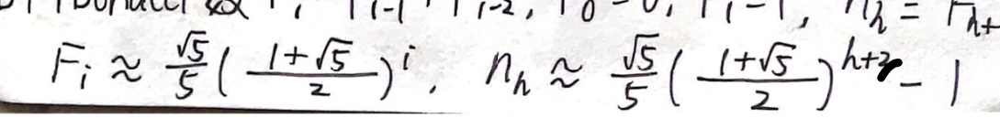，所以高为 h 的 AVL Tree 节点个数满足 $O((\frac{1+\sqrt{5}}{2})^h)$

#### 操作

Search、insert、delete 操作与 BST 相同
不同的是需要使用 Rotation 维护
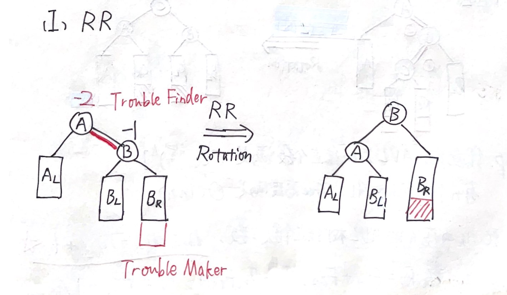
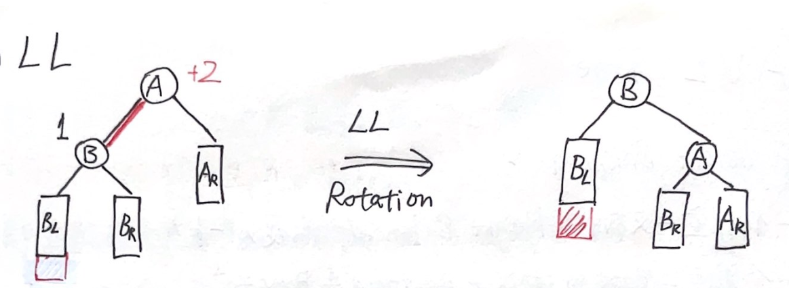

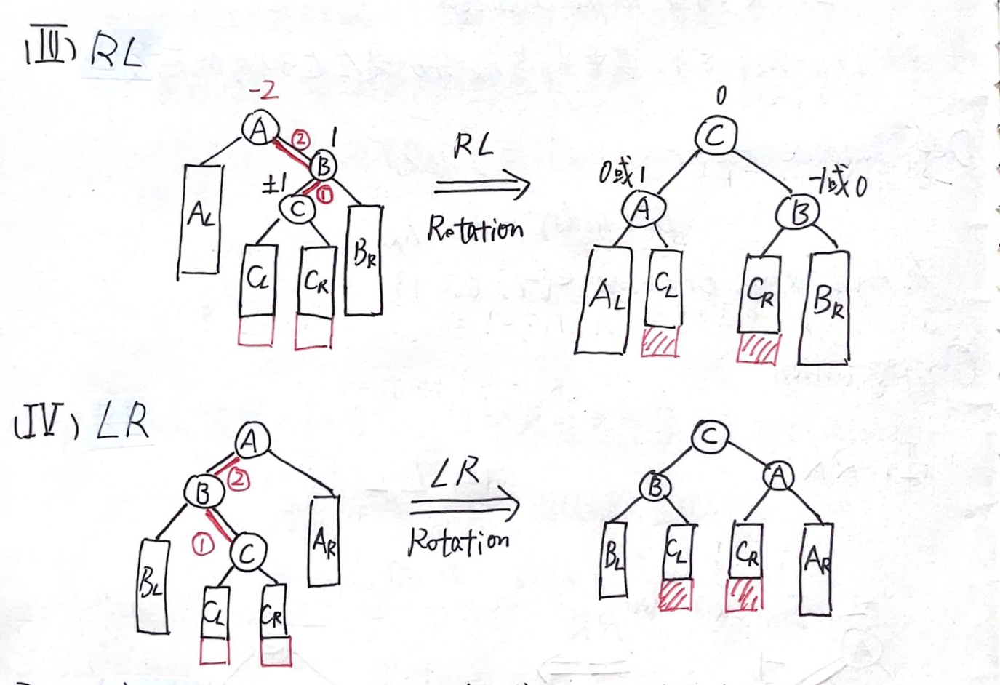

#### 复杂度
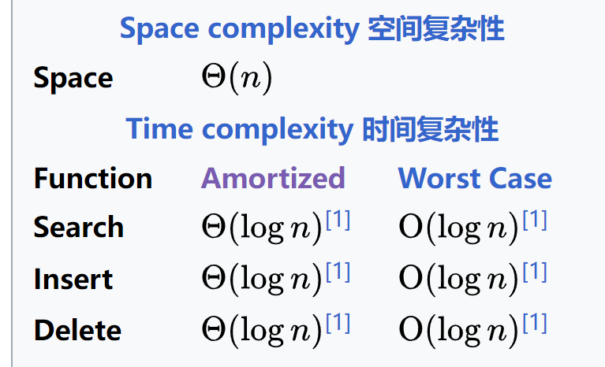

### Splay Tree
#### 结构
1. 一种自平衡树，**平均性能**与 AVL树一样高效，且不需要记录额外数据，缺点是 worst case中会形成一个链表

#### 操作
Search、insert、delete 操作与 BST 相同
不同的是每次访问或插入或删除的节点后需要旋转至顶点处
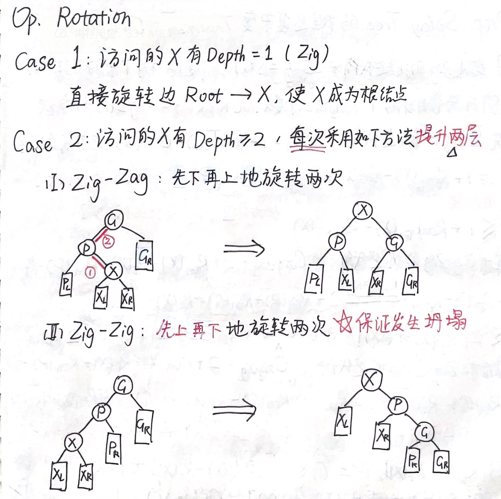

#### 复杂度
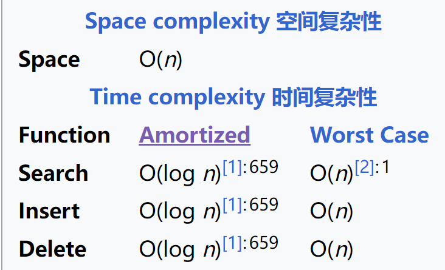

复杂度这里要注意 Splay Tree 的  Amortized Analysis:

记 $Rank(i) = \log{S(i)}$ , S(i) 为含自身的 i 的下属子节点个数

势能函数为 $\Phi(T) = \sum{\log S(i)}$，对树中的所有 i 

### Red-Black Tree
#### 结构
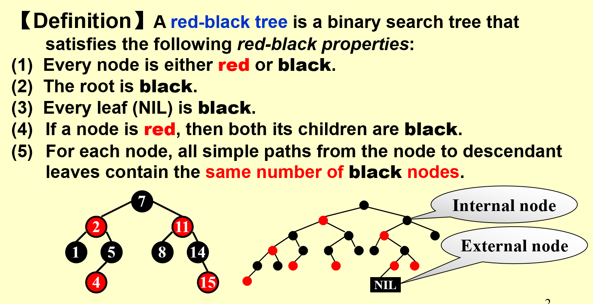

Black-Height：从 X 开始到它任意的叶子后代路径上的黑节点个数且不含自身且包含NIL

定理：有 N 个 internal nodes 的红黑树最高为 2log(N+1)
$bh(Tree) \geq \frac{1}{2}h(Tree)$
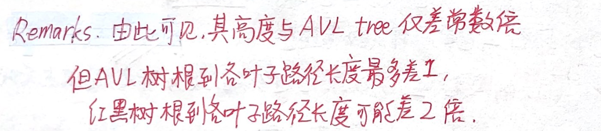

#### 操作
1. 插入： 
   - 插入的节点的parent 若为黑 或 插入空树
   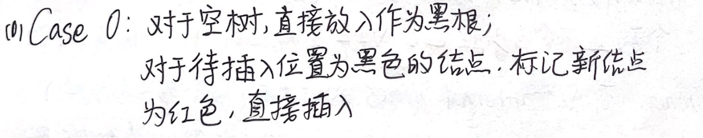
   - 否则，两类(Parent's siblng 是否为红），3种Case
      - 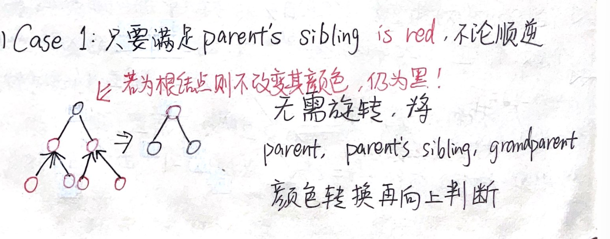
      - 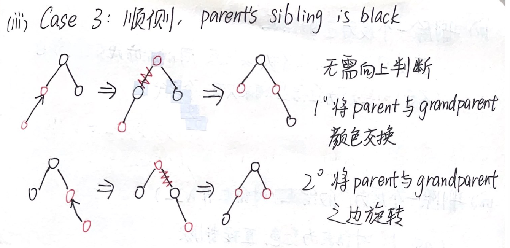
      - 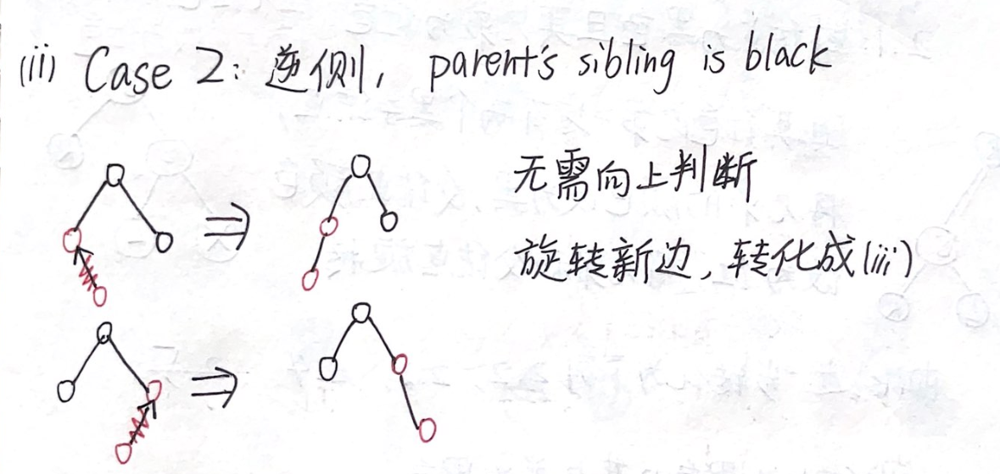
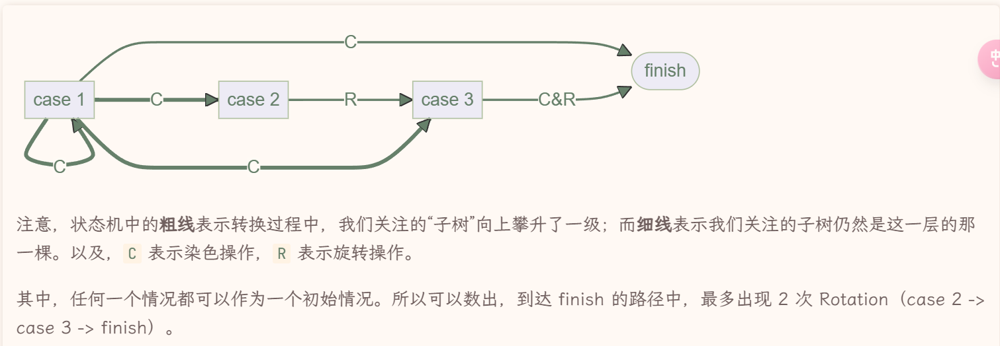
**插入 最多出现两次 Rotation ！！！**
2. 删除
    - 放弃弄懂
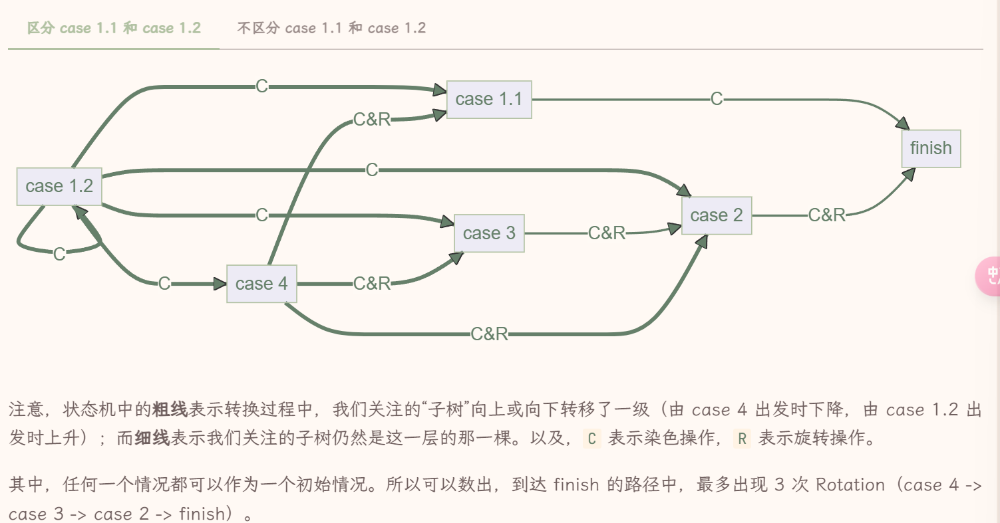
**删除 最多出现三次 Rotation ！！！**

#### 复杂度
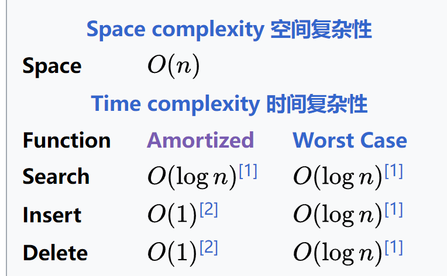
**注意 search 与 BST 相同，但 insert 和 delete 都是常数级复杂度！**

### B+ Tree
> 略
> 要注意 叶子节点和非叶子节点是不同的 叶子节点只存放 Key
> 要注意 root的特殊性：可以当成叶子也可以当成非叶子节点，删除时root会被删除
#### 复杂度
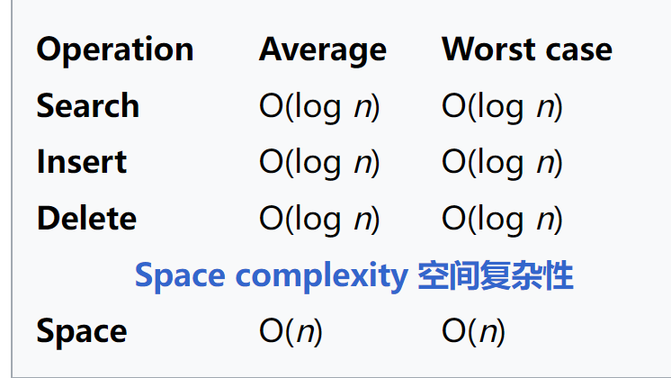
### Leftist Tree

#### 结构
1. Leftist Tree 其实是一个自调整堆
2. 有 N 个节点的左氏堆，右路径上最多有 $\lfloor \log(N+1) \rfloor$，等价于：有r个节点在**右路径**上，该左式堆至少有 2^r-1 个节点
#### 复杂度
堆的删除（合并左右子树）和插入（与单节点数合并）操作都可以看成合并
所以 Leftist Tree 的删除、插入、合并复杂度均为 O（logN)

另外，N 元素的建堆时间为 O(NlogN)

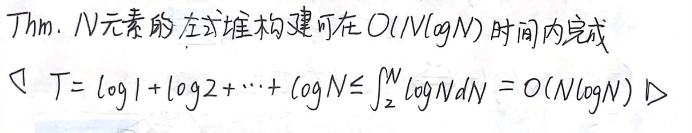

### Skew Heap
> 有点乱，放弃
#### 结构
#### 复杂度
堆的删除（合并左右子树）和插入（与单节点数合并）操作都可以看成合并
Skew Heap的删除、插入、合并**均摊复杂度**均为 O（logN)

> 注意 均摊分析时定义的 heavy node和light node 以及其性质

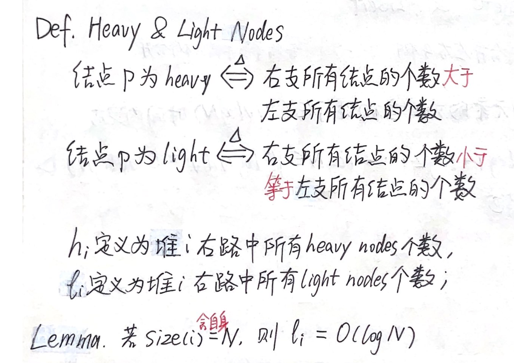

特殊例子：以升序插入 2^k-1个节点，总能得到 full binary tree
### Binomial Queue

#### 结构
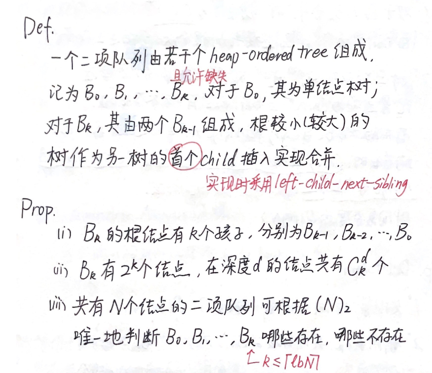
#### 各操作及其复杂度
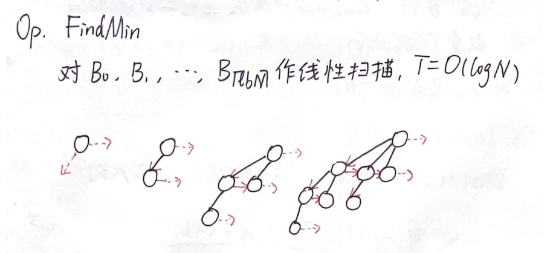
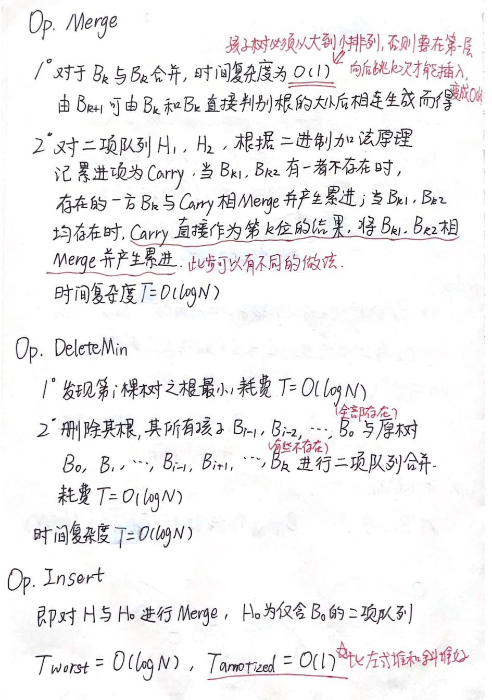

> 复习算法部分

### Backtracking

### Divide & Conquer

### Dynamic Programming