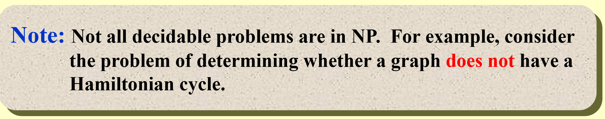

# Advanced Data Structure
## NP Completeness
!!! intro 
    问题有简单复杂之分，本节对区分问题的难度的标准做讨论    
### 概述
!!! quote
    OI Wiki: [https://oi-wiki.org/misc/cc-basic/](https://oi-wiki.org/misc/cc-basic/)
根据问题的难度，问题可划分为：
- 可计算问题：
  - P问题 polynomial time
  - NP问题 nondeterministic polynomial time
  - NPC问题 NP complete
  - NPH问题 NP hard
- 不可判定问题：undecided problem
  - example: halting problem, 集合论中当问题涉及自身时就会出现逻辑谬误

下面给出可判断问题的几类的详细介绍：
!!! P
    P 取自 polynomial time，指的是可以用[确定型图灵机](https://en.wikipedia.org/wiki/Turing_machine)🔍在多项式时间内解决的问题。
    也就是我们通常意义下所说的，可以在多项式时间内解决的问题。

!!! NP
    NP 即 nondeterministic polynomial time，指的是可以用[非确定型图灵机](https://en.wikipedia.org/wiki/Nondeterministic_Turing_machine)🔍在多项式时间内解决的问题。这个说法等价于可以用确定型图灵机🔍在多项式时间内验证（判断答案是否正确）。
    也就是我们通常意义下所说的，可以在多项式时间内验证的问题

1. **需要注意的是，并不是所有的可判断问题都是 NP 问题**

2. $P\subseteq NP$ 是显然的， 因为任何一个可在多项式时间内解决都可在多项式时间内验证, 但 $P \subset NP$ 是否正确，目前仍然没有答案，即我们仍然不知道是否存在多项式算法可以解决一切 NP 问题！

!!! NPC 

    NPC 即 NP complete，NP 完全，是 NP 中最难的决定性问题（并不是无限定词的最难的问题！）。而我们称满足如下条件的问题为 NPC 问题：

    1. 是一个 NP 问题；
    2. 所有 NP 问题都可以多项式时间归约为该问题；
    3. 
    由 2 可以有结论，所有的 NPC 问题难度相同——一旦有一个 NPC 问题被解决，那么所有 NPC 问题，乃至所有 NP 问题都能被解决。

    如果我们试图证明一个问题是 NPC 问题，我们可以通过这种手段：

    1. 判定该问题是一个 NP 问题；
    2. 判定一个已知的 NPC 问题可以多项式时间归约为该问题，或判定该问题是 NPH（在下面）问题；

    !!! polynomial reduction
        如果我们能在多项式时间的复杂度内，将问题 A 转化为问题 B，则称问题 A 可以多项式时间归约(polynomial reduce)为 B，记为 ​$A\leq_p B$，表示 A 不会比 B 难。

!!! NPH
    NP hard，即非常非常难的问题。作为非常非常的问题，它不一定需要是 NP 问题。而所有 NP 问题都可以多项式时间归约为 NPH 问题。

**PS：** NPC = $NP \bigcap NPH$