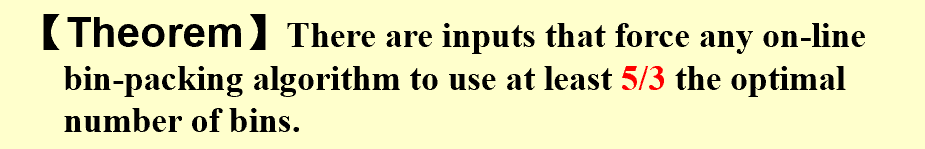
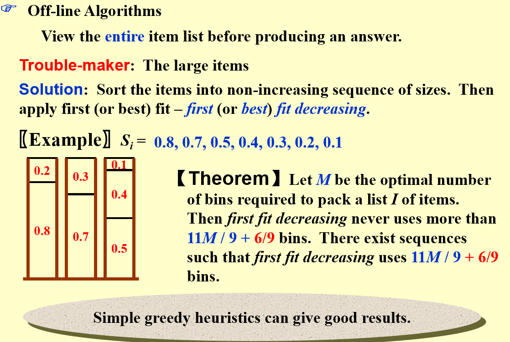

# ADS
## Approximation
### 

### example

#### Bin-Packing
##### On-Line
!!! Next Fit
    复杂度 O(N)
    近似比 2
!!! First Fit & Best Fit
    复杂度 $O(N)$, can be optimized t o $O(N\logN)$
    近似比 接近于 1.7
On-Line 算法只能考虑前面的输出，有局限性

##### Off-Line
