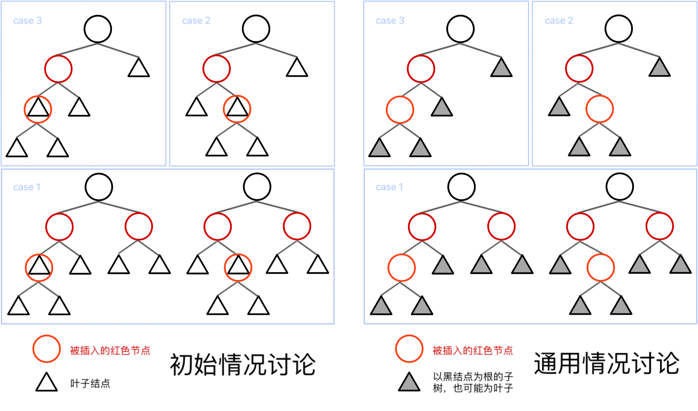
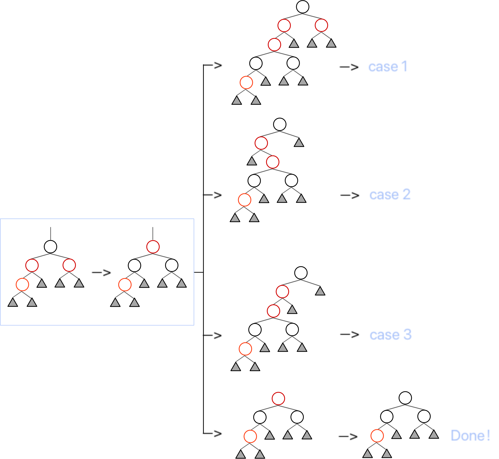

# Advanced Data Structure
## Week 2

### Red Black Tree
#### Definition
!!! quote link
    OI Wiki: https://oi-wiki.org/ds/rb-tree/
!!! definition "定义"
    
    5条性质要记
    !!! note "Black Height"
        特定节点的黑高，等于该节点到叶结点到简单路径中（不包括自身），黑色节点的数量
    !!! note "Red-Black Property about Black Height"
        一个有$N$个内部节点的红黑树的高度至多为$2\log(N+1)$
        证明如下：
        
#### Methodology
> 插入和删除的方法
##### Insert
记被插入的节点为 x，任意一个节点 node 的家长节点为 node.p，则：

1. 如果 x.p 是黑色的，那么我们不需要做任何调整；
2. 如果 x.p 是红色的，那么我们需要进行调整；
    - 此时因为原来的树符合红黑性质，x.p.p 必定存在（红 x.p 不能是根）且必定是黑色的；

对于需要进行调整的情况，我们需要分情况讨论：
!!! definition "Cases"
    
    我们采用了Bottom-Up的方法，即从 x 开始，向上递归转移，直到根节点。所有情况都被归纳为上图右半部分
    !!! note "Case 3"
        一次染色和一次旋转即可
        
    !!! note "Case 2"
        进行一次LR Rotation，转化为Case 3
        
    !!! note "Case 1"
        Case 3的两种情况是等价的
        图中的根节点染红，将根的两个子节点染黑，类似于将黑节点“下放”， 插入的红节点“上浮”，递归转移
        
        通过第一步操作，我们可以保证这整个子树必定平衡、不影响家长节点的黑高（除了家长是根的情况）且红点不邻的。
        然而我们并不知道这个根的家长节点是否是红色节点，因此做分类讨论。倘若其根的家长节点是红色节点，那么我们还需要向上递归，继续调整，根据实际情况转化为其他 case；若这子树的根没有家长节点，则直接染黑红根即可；而倘若子树根节点的家长节点是黑节点，那么我们就调整完毕了
    这三个过程中，我们观察到，只有 case 1 的转化会导致我们递归向上，而 case 2 向 case 3 的转化并不会导致我们改变关注的子树的范围。
    为了更清晰地看出各个方法之间的转化关系，于是我们可以画一个状态机
    
    注意，状态机中的粗线表示转换过程中，我们关注的“子树”向上攀升了一级；而细线表示我们关注的子树仍然是这一层的那一棵。以及，C 表示染色操作，R 表示旋转操作
    其中，任何一个情况都可以作为一个初始情况。所以可以数出，到达 finish 的路径中，最多出现 2 次 Rotation（case 2 -> case 3 -> finish）
##### Delete
!!! quote link
    写不了一点，看 [isshikihugh's notebook](https://note.isshikih.top/cour_note/D2CX_AdvancedDataStructure/Lec02/#%E5%88%A0%E9%99%A4)真的非常好

### B+ Tree

#### Definition
!!! quote link
    OI Wiki: https://oi-wiki.org/ds/bplus-tree/
B+ 树是一种用树状形式维护有序数列比较信息的数据结构，其增改操作拥相对于二叉树结构更加稳定的对数时间复杂度，通常用于数据库和操作系统的文件系统中