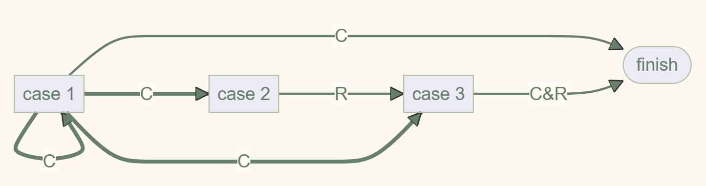

# Advanced Data Structure
## Week 2

### Red Black Tree
#### Definition
!!! quote link
    OI Wiki: [https://oi-wiki.org/ds/rb-tree/](https://oi-wiki.org/ds/rb-tree/)
!!! definition "定义"
    
    5条性质要记
    !!! note "Black Height"
        特定节点的黑高，等于该节点到叶结点到简单路径中（不包括自身），黑色节点的数量
    !!! note "Red-Black Property about Black Height"
        一个有$N$个内部节点的红黑树的高度至多为$2\log(N+1)$
        证明如下：
        
#### Methodology
> 插入和删除的方法
##### Insert
记被插入的节点为 x，任意一个节点 node 的家长节点为 node.p，则：

1. 如果 x.p 是黑色的，那么我们不需要做任何调整；`Case 0`
2. 如果 x.p 是红色的，那么我们需要进行调整；
    - 此时因为原来的树符合红黑性质，x.p.p 必定存在（红 x.p 不能是根）且必定是黑色的；`Case 1,2,3`

对于需要进行调整的情况，我们需要分情况讨论：
!!! definition "Cases"
    **我们采用了Bottom-Up的方法，即从 x 开始，若此时能够是能解决的Case(即Case0、Case3或Case2)，则问题在这里解决；若解决不了（即Case1）,则向上递归将问题甩锅x的爷节点。重复此步骤，直到问题解决。**
    >最坏的情况问题也会在根节点时解决，因为由定义根节点必定是黑色的

    由上，所有情况可被归纳为上图右半部分
    
    !!! note "Case 3"
        一次染色和一次旋转即可
        
    !!! note "Case 2"
        进行一次LR Rotation，转化为Case 3
        
    !!! note "Case 1"
        Case 3的两种情况是等价的
        图中的根节点染红，将根的两个子节点染黑，类似于将黑节点“下放”， 插入的红节点“上浮”，递归转移
        
        
    为了更清晰地看出各个方法之间的转化关系，于是我们可以画一个状态机
    
    注意，状态机中的粗线表示转换过程中，我们关注的“子树”向上攀升了一级；而细线表示我们关注的子树仍然是这一层的那一棵。以及，C 表示染色操作，R 表示旋转操作
    其中，任何一个情况都可以作为一个初始情况。所以可以数出，到达 finish 的路径中，最多出现 2 次 Rotation（case 2 -> case 3 -> finish）
##### Delete
!!! quote link
    写不了一点，找了几篇资料，我觉得[这篇](https://www.geeksforgeeks.org/deletion-in-red-black-tree/)最好
- 对我来说比较清楚的思路是将红黑树的删除操作分为两步：直接删除节点（不考虑红黑树性质）和修复红黑树性质
    - 对于 Part I，将删除的节点分成三类，no children, one child or two children，然后分别讨论
    !!! note
        这里对于 node with two children 的情况，我们是去找到它的后继节点 **in-order successor**，然后将后继节点的值赋给它，然后删除后继节点，相当于删除的其实是后继节点
        
        这样做的好处是后继节点一定没有 left child 的，所以删除后继节点的操作会变得简单
    - 对于 Part II， 史
        - [上面那篇](https://www.geeksforgeeks.org/deletion-in-red-black-tree/)引入了Double Black和Single Black的概念，使乱七八糟的情况稍微清晰了一点

### B+ Tree

#### Definition
!!! warning 注意
    网上关于B+的定义有好多版本，相互之间可能是矛盾的。
    
!!! quote link
    OI Wiki: [https://oi-wiki.org/ds/bplus-tree/](https://oi-wiki.org/ds/bplus-tree/)
B+ 树是 [B 树](https://oi-wiki.org/ds/b-tree/) 的一个升级，它比 B 树更适合实际应用中操作系统的文件索引和数据库索引。目前现代关系型数据库最广泛的支持索引结构就是 B+ 树。

B+ 树是一种多叉排序树，即每个节点通常有多个孩子。一棵 B+ 树包含根节点、内部节点和叶子节点。根节点可能是一个叶子节点，也可能是一个包含两个或两个以上孩子节点的节点。

B+ 树的特点是能够保持数据稳定有序，其插入与修改拥有较稳定的对数时间复杂度。B+ 树元素自底向上插入，这与二叉树恰好相反。

!!! note 一棵 m 阶的 B+ 树的性质
    **m阶 指的是一个节点的子树个数n $\leq$ m**
    **m也可称为一棵树的Max Degree**
    **2-3树指的就是3阶B+树，2-3-4树指的就是4阶B+树**
    **注意：叶子节点的关键字和它的字数个数一样，即叶子节点最多能放m个关键字；而非叶子节点，关键字最多只有m-1个（最多形成m个区间）**
    

    !!! example
        一棵 B+ 树的例子
        

#### Methodology
> 插入和删除的方法

##### Find
从根节点开始，根据关键字的大小，找到对应的子树，直到找到叶子节点

!!! note "OI Wiki 上的代码实现"
    ```cpp
    T find(V key) {
    int i = 0;
    while (i < this.number) {
        if (key.compareTo((V)this.keys[i]) <= 0) break;
        i++;
    }
    if (this.number == i) return null;
    return this.childs[i].find(key);
    }
    ```
##### Insert
- 若为空树，创建一个叶子节点
- 针对叶子节点，插入关键字，若超过阈值，分裂，递归转移到父节点（索引节点）进行维护
- 针对索引节点，若当前节点关键字的个数小于等于 m-1，则插入结束。否则，将这个索引类型节点分裂成两个索引节点，左索引节点包含前 $(m-1)/2$ 个 key，右节点包含 $m-(m-1)/2$ 个 key，将第 $m/2$ 个关键字进位到父节点中，（少了一个关键字）进位到父节点的关键字左孩子指向左节点，进位到父节点的关键字右孩子指向右节点。将当前节点的指针指向父节点，然后重复这一步

##### Delete
1. 首先查询到键值所在的叶子节点，删除该叶子节点的数据。
2. 如果删除叶子节点之后的数据数量，满足 B+ 树的平衡条件，则直接返回。
否则，就需要做平衡操作：如果该叶子节点的左右兄弟节点的数据量可以借用，就借用过来满足平衡条件。否则，就与相邻的兄弟节点合并成一个新的子节点了。
1. 在上面平衡操作中，如果是进行了合并操作，就需要向上修正父节点的指针：删除被合并节点的键值以及指针。
2. 由于做了删除操作，可能父节点也会不平衡，那么就按照前面的步骤也对父节点进行重新平衡操作，这样一直到某个节点平衡为止。

