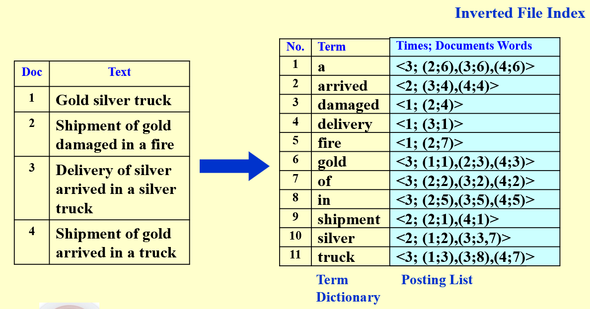
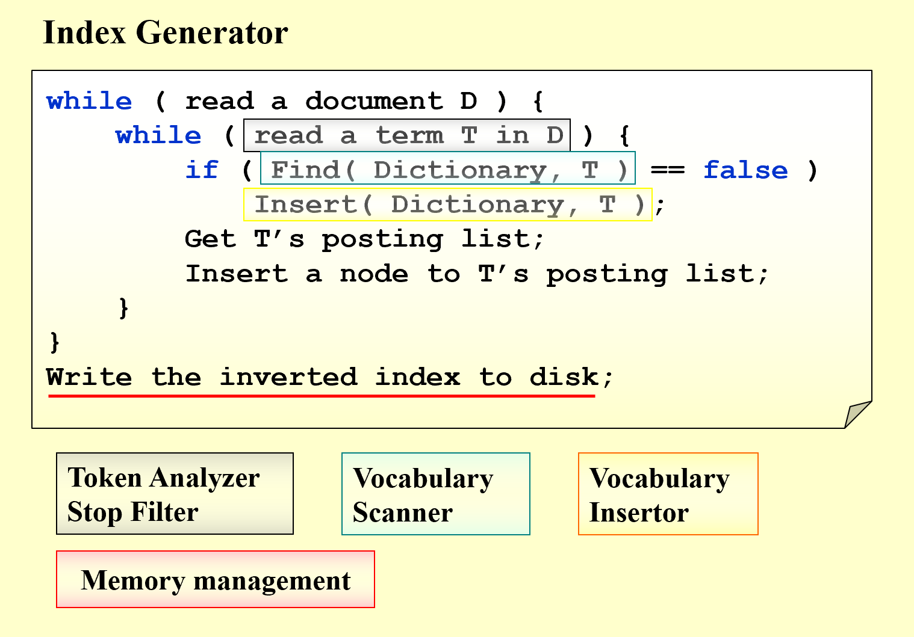
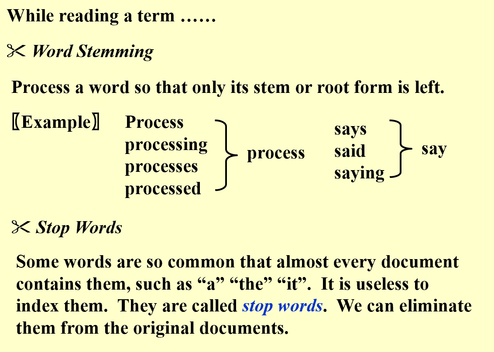
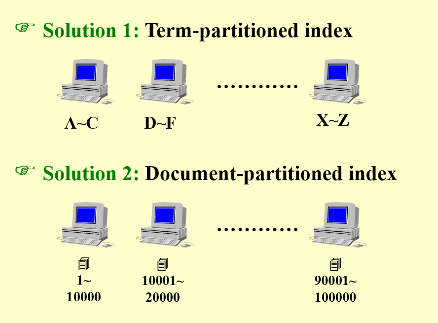
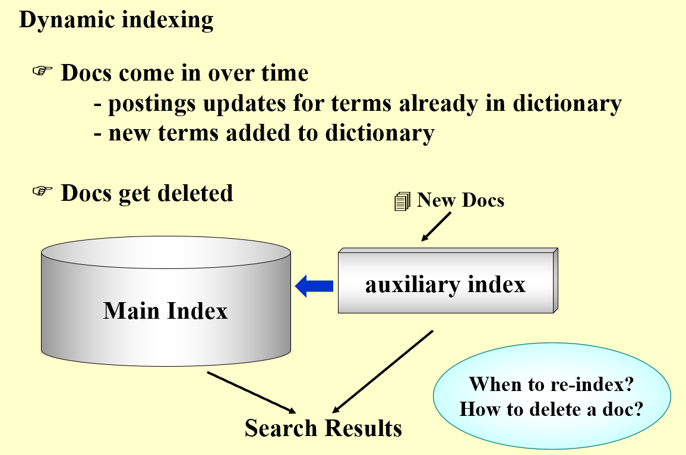
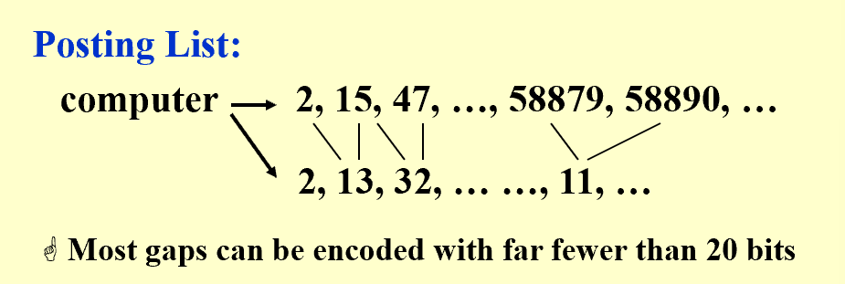
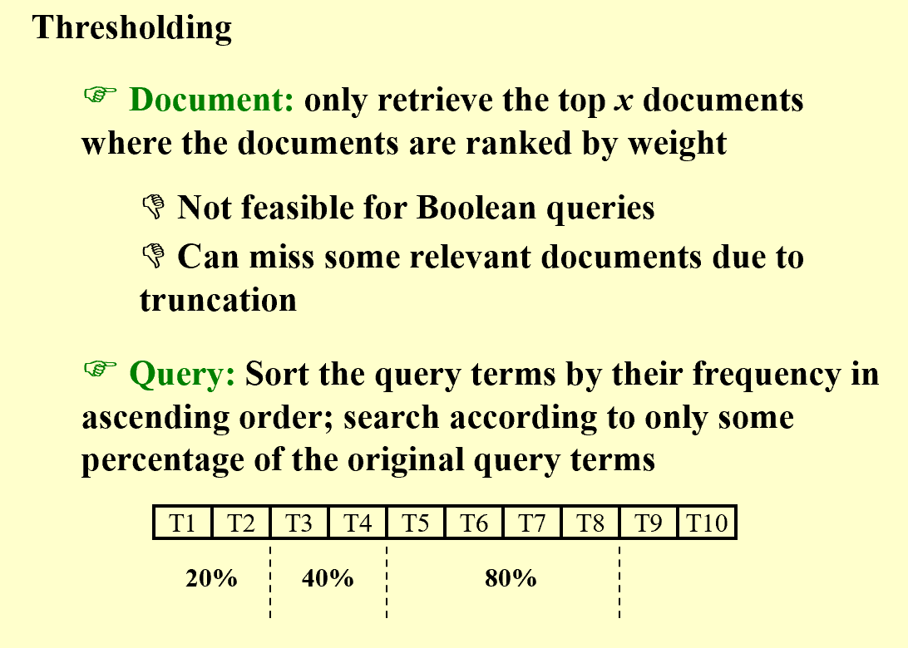
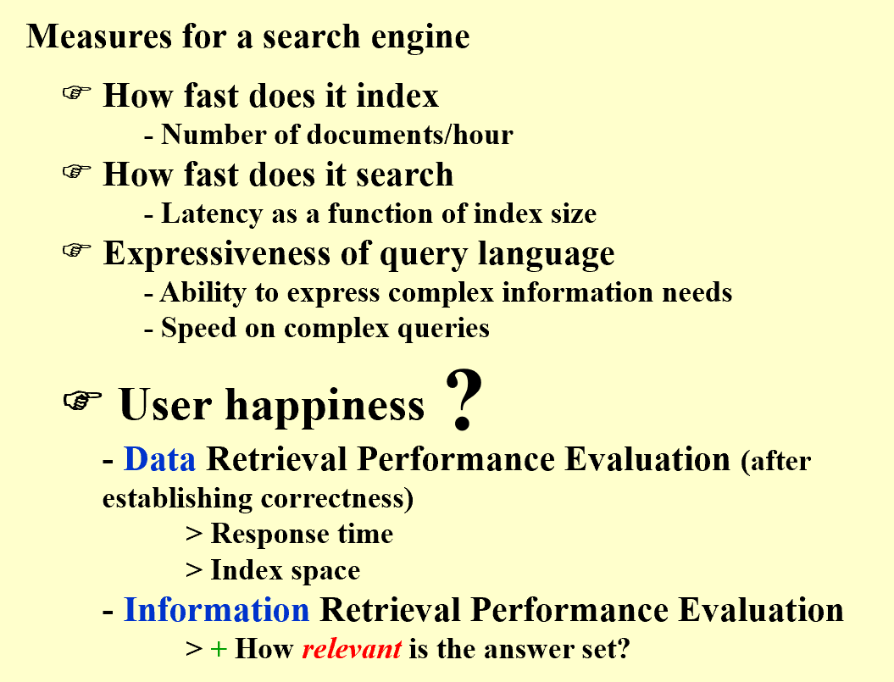
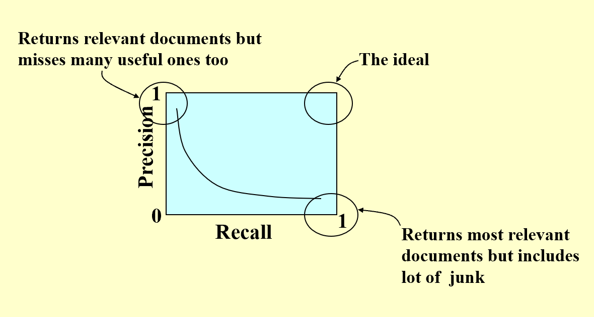

# Advanced Data Structure
## Week 3
### Inverted File Index
!!! note 
    Term-Document Incidence Matrix is too sparse to store, so we introduce Inverted File Index
    - Inverted File Index is a mapping from terms to the documents that contain them (**adjacent list**)
#### Definition
!!! pic 
      
    1. How to easily print the sentences which contain the words and highlight the words?
    - **Inverted File Index** records the positions of words in each document
    1. Why do we keep "times" in the list?
    - Times represents the frequency of the word in the document, which affects the effieciency some operations. AND操作从最小频率的term开始求交，速度快

#### Methodology

##### Index Generator
!!! note 各步骤实现
    !!! note "**Token Analyzer & Stop Filter**"
        - Token Analyzer: 词法分析器，将文本分割成单词
        - Word Stemming: 将输入文本中的 'says' 'said', 'saying' 都 当成 'say', 所以能提升召回率 recall，但减少了precision
        - Stop Filter: 去除停用词，如“a”，“the”等
        
    !!! note "**Vocabulary Scanner**"
        - omitted, 课件上找不到对应的
    !!! note "**Vocabulary Insertor**"
        - Solution 1：B-, B+, Tries Tree
        - Solution 2：Hashing
    !!! note "**Memory management**"
        - Solution 1：Distributed Indexing
        分布式又有两种 
        
        Document-partitioned较好，体现在：一台机器宕机，不像Term-partitioned整个index系统失效，只会影响一部分Document的index
        - Solution 2：Dynamic Indexing
        
        - Solution 3：Compressed Indexing
        
        需要做index的Doc可能会是一个天文数字，直接按0、1、2、3...的顺序编码，会直接超出数据类型范围。因为Posting List是有序的，所以可以采用差分编码，减少存储空间
        
##### Query Processor
!!! note
    - Threshold
    
    对于Query的处理，可以设置阈值，只返回频率大于阈值的term, 优先处理频率小的term
    - Measure for a search engine
    
    ***注意 Data Retrieval 和 Information Retrieval**有不同的目标和衡量标准:
    Data Retrieval仅是找到包含term的文档，而Information Retrieval是找到relevant的文档*

    !!! note 
        对于 Relenvance, 可以用Precision和Recall来衡量
        - Precision: 找到的文档中，有多少是相关的
        - Recall: 所有相关的文档中，找到了多少 
        

