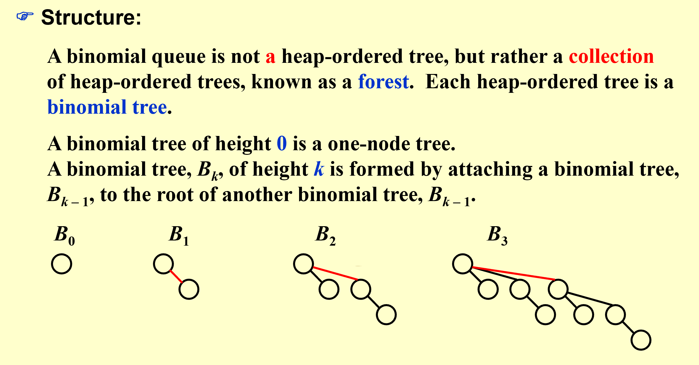
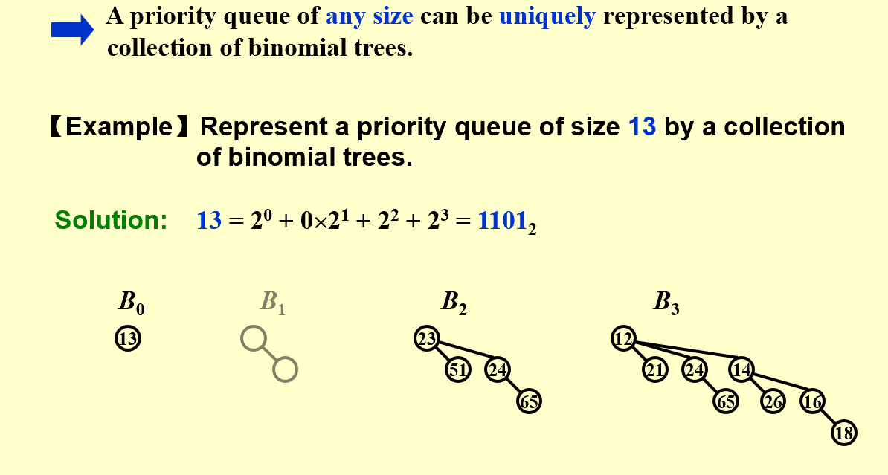
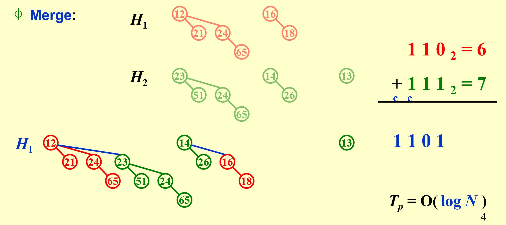
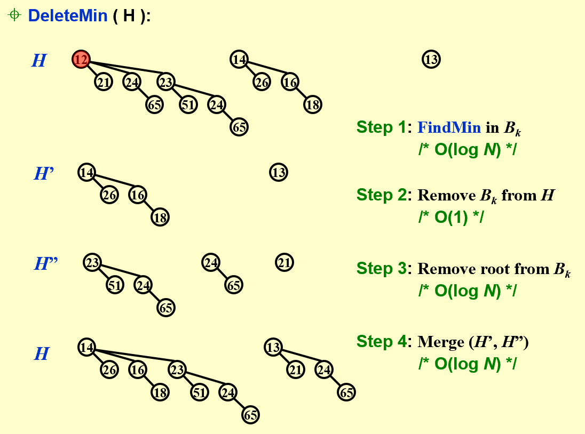
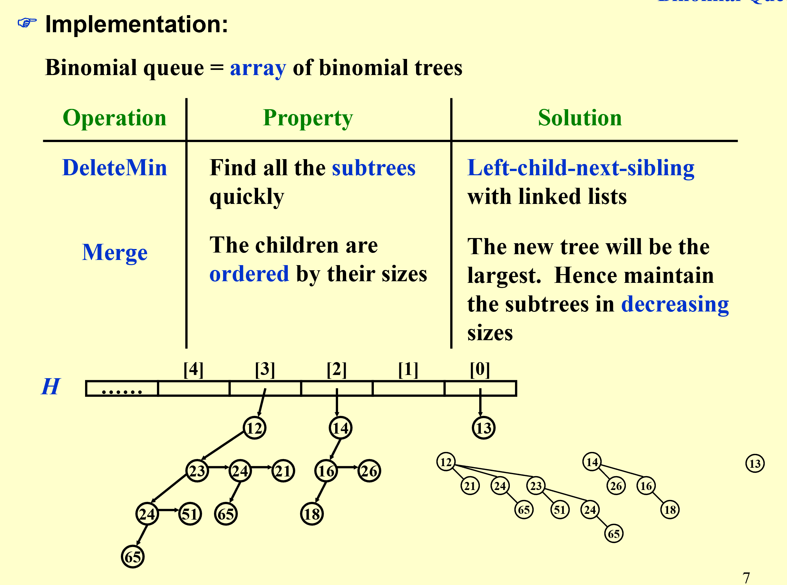
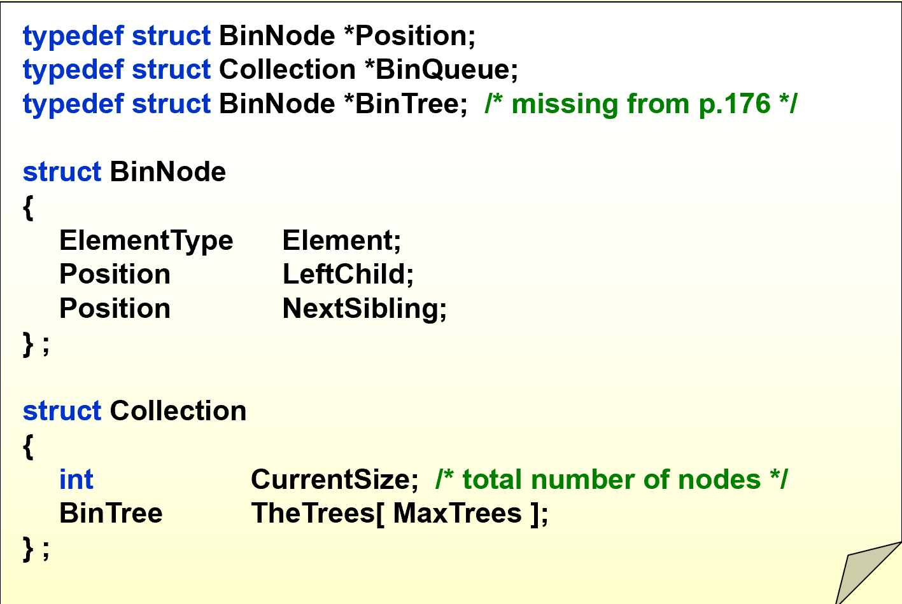
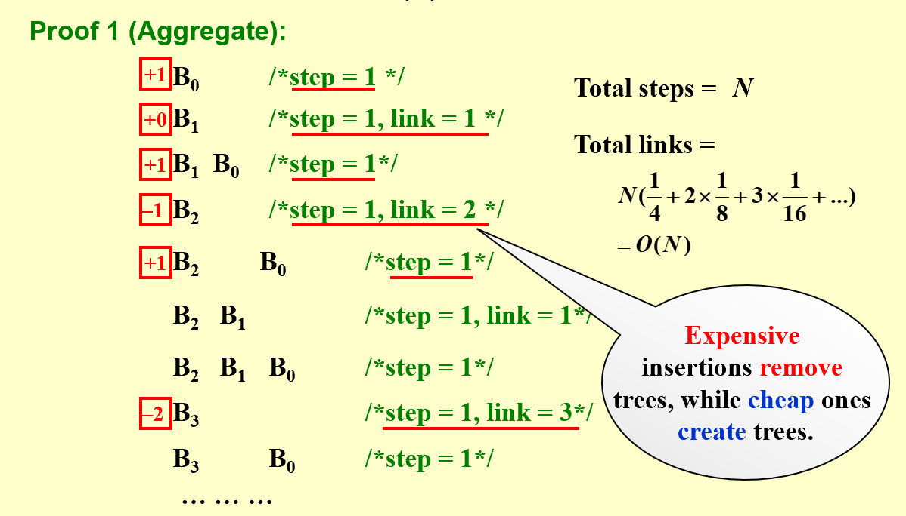
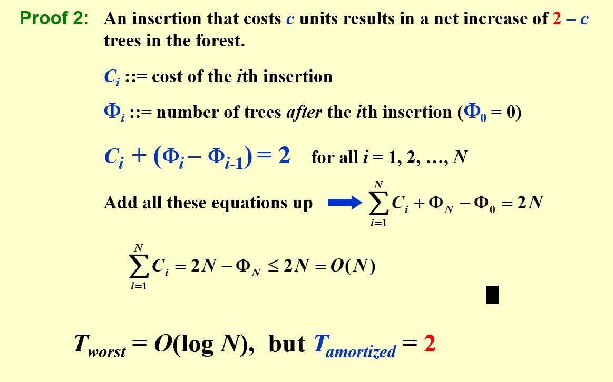

# Advanced Data Structure
## Binomial Queue
>  堆的其中一个应用就是优先队列（对原来队列中的元素附加一个优先级，优先级越高的元素越早出队）。本节介绍的二项队列（**Binomial Queue**也是优先队列的一种应用，只不过不同于之前
### definition
二项队列(**Binomial Queue**)本质上是一系列二项树(**Binomial Tree**)的集合

!!! note
    
    下面是二项树的性质：
    - 二项树满足堆的性质，所有parent节点的值小于或大于child节点的值。
    - k 阶二项树是由两个 k-1 阶二项树合并得到的（类似于二进制的进位）。合并方式是让其中一棵树成为另外一个树的根节点的子树。
    - 二项树 $B_k$ 总共 有 $2^k$ 个节点，其中根节点有$k$ 个节点
    - 二项树 $B_k$ 第d层的节点个数符合二项式定理中的二项式系数（根节点所在层为第0层）。如 $B_3$ 各层节点数为：1，3，3，1
     

    下面是二项队列的性质：
    
    - 类似于二进制表达整数
    - 由二项树第三条性质，一棵从位置0到k全放满元素的二项队列，总共有 $1+2+3...+2^{k-1}+2^k=2^{k+1}-1$ 个节点。所以将N个元素使用二项队列储存，最多有 $\lceil \log{N} \rceil$个根节点

### Methodology
> 为什么要这么设计二项队列？它的优势？

#### FindMin

#### Merge:

#### DeleteMin


### Implementation
#### define structure

> 注意对于二项队列，我们一般不需要随机访问它的每个元素$B_i$，所以比起用PPT上用数组储存，更多时候还是用链表存储的。见[Wiki](https://en.wikipedia.org/wiki/Binomial_heap#Implementation)



在实际实现时,我们还会使用 **CurrentSize**记录当前二项队列中的节点数。
目的:使用下面的循环
```c
    for (int j=1; j <= H->CurrentSize; j *= 2) 
```
可以很方便地遍历二项队列的每一层（无论有没有元素）

#### Operation Implementation
**看懂PPT上的每个操作的代码实现，此处略**

### Amortized Annalysis

> 建队列只需要 O(N) 的平摊时间，相比左偏堆的优化:二项队列既使得合并操作达到了 O(logN)，又保持了和二叉堆一样线性建立时间。

#### Proof

