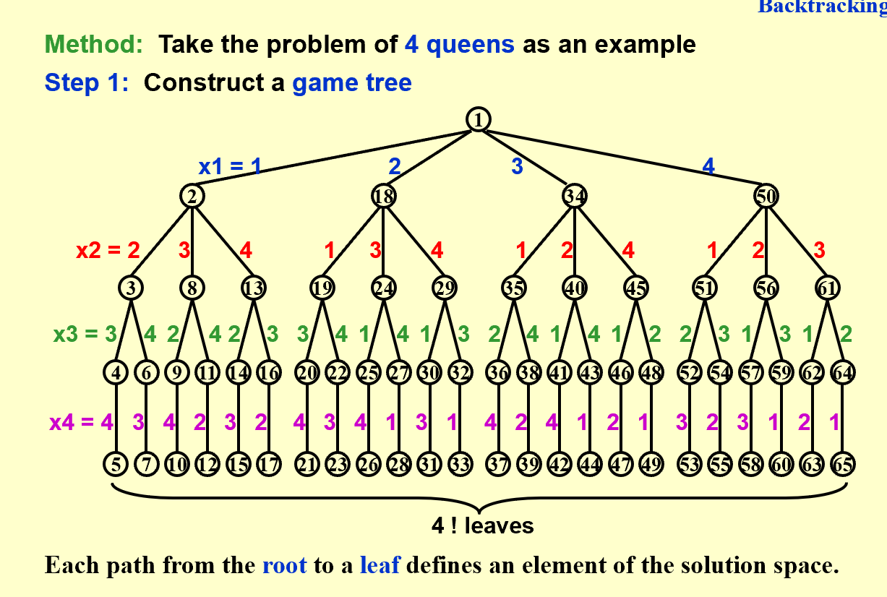
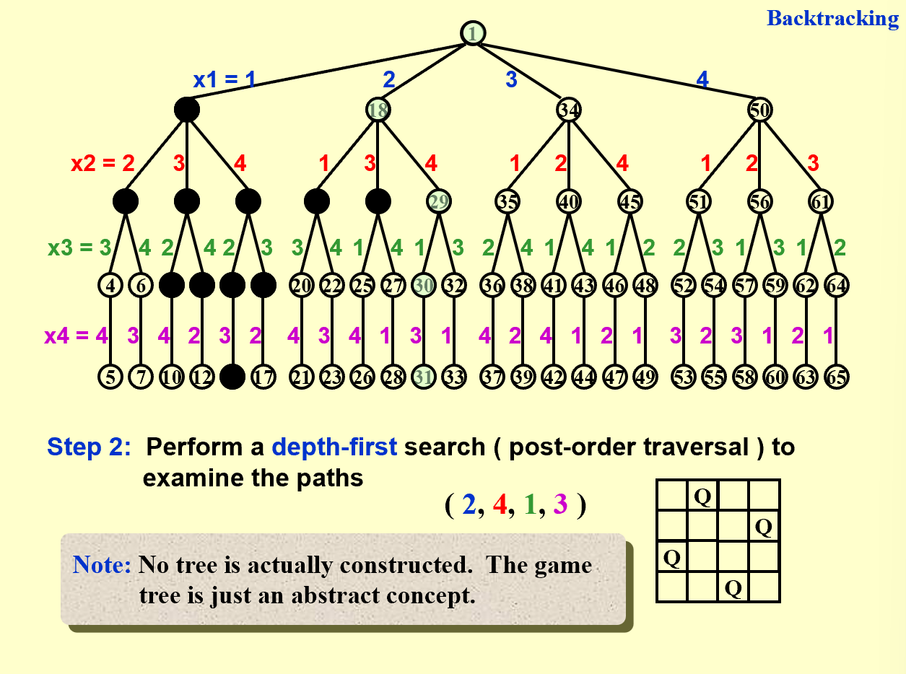
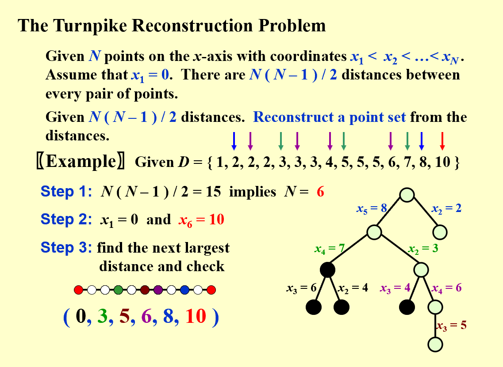
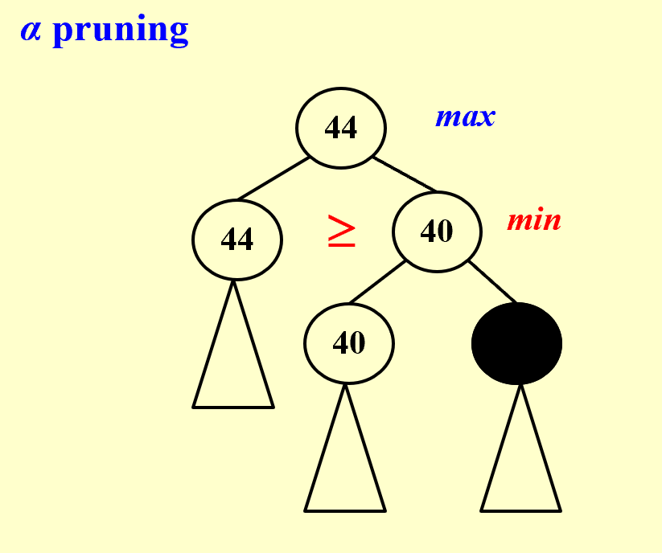
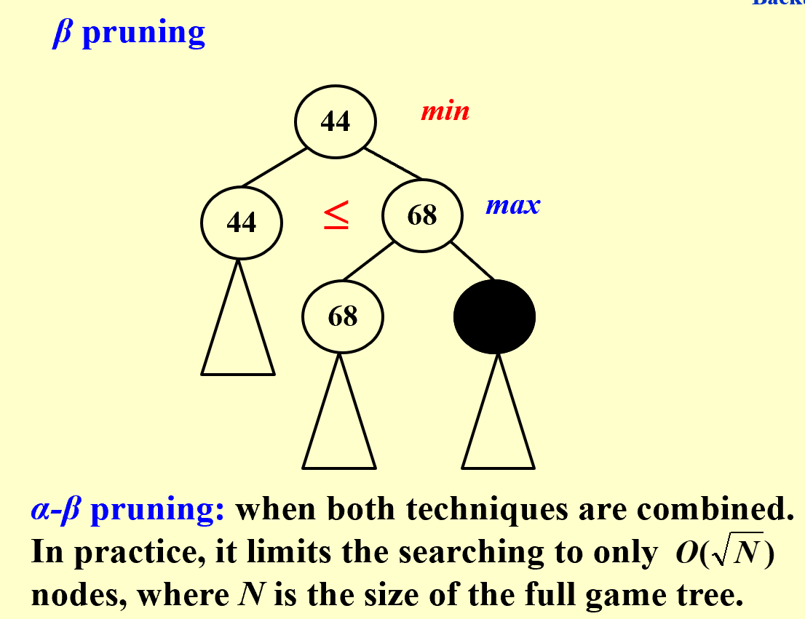

# Adanvanced Data Structure
> start algorithm part
## Backtrack

### Eight Queen
1. Construct a game tree

2. Perform a depth-first searcj (post-order traversal) to examine the paths

### The Turnpike Reconstruction Problem

### Tic-tac-toe: Minimax Strategy
$\aleph-\beta pruning$

