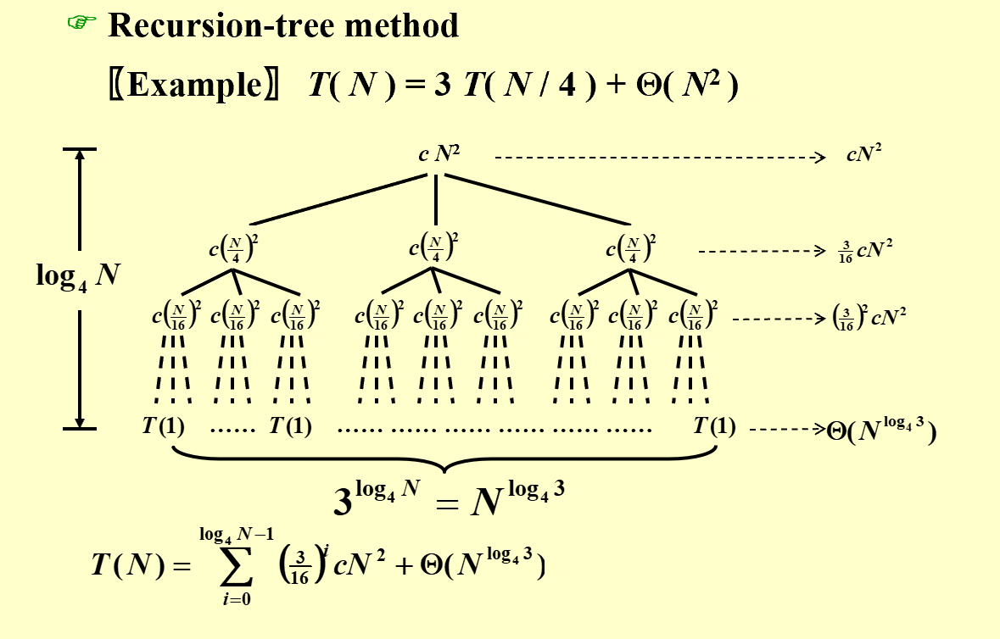
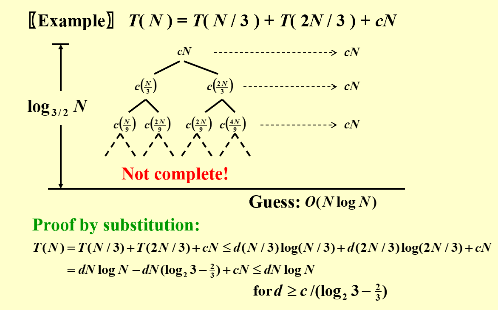

# Adanvanced Data Structure
## Divide and Conquer

### 概述
!!! link
    Wikipedia: [https://en.wikipedia.org/wiki/Divide-and-conquer_algorithm](https://en.wikipedia.org/wiki/Divide-and-conquer_algorithm)

### 复杂度分析
#### 1 Substitution Method
#### 2 Recursion Tree Method

层层展开--->树状结构
需要知道什么？ 1. 树的深度 2. 除叶子层外每层 3. 叶子层节点个数

遇到树高不方便确定的情况，会使用更具树形图使用Substitution Method
