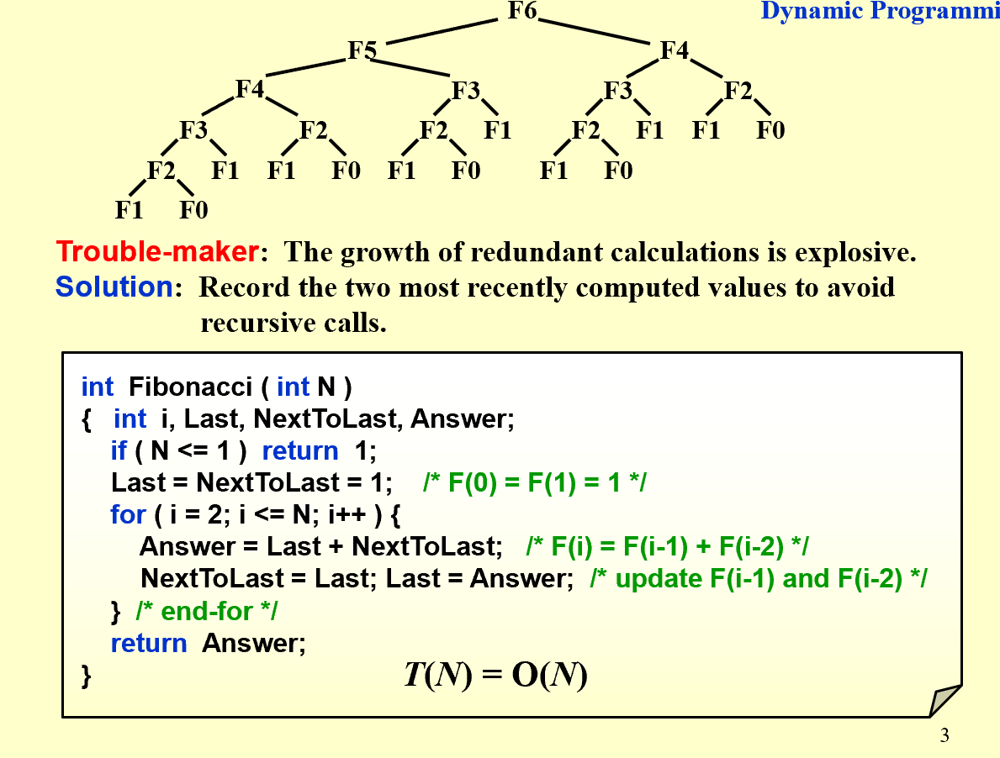
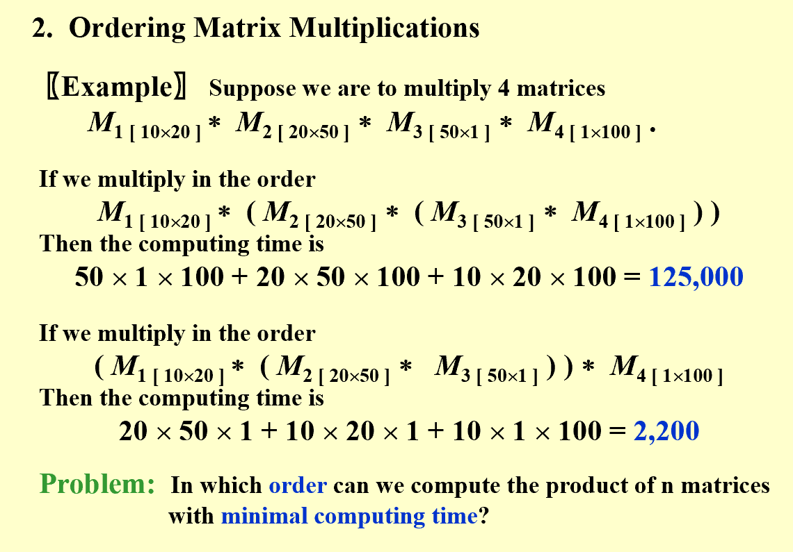
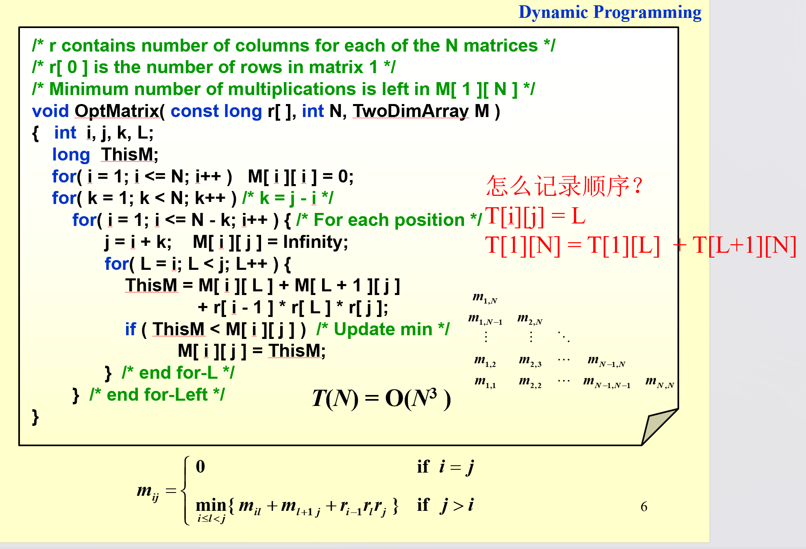
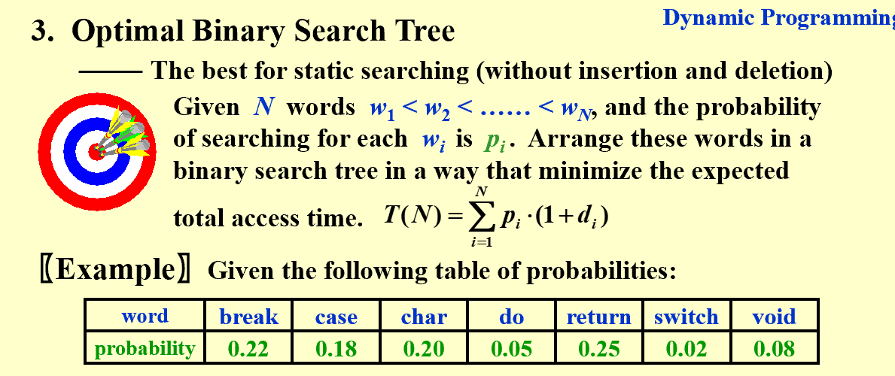
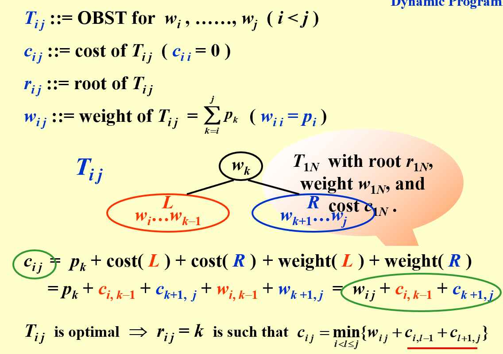
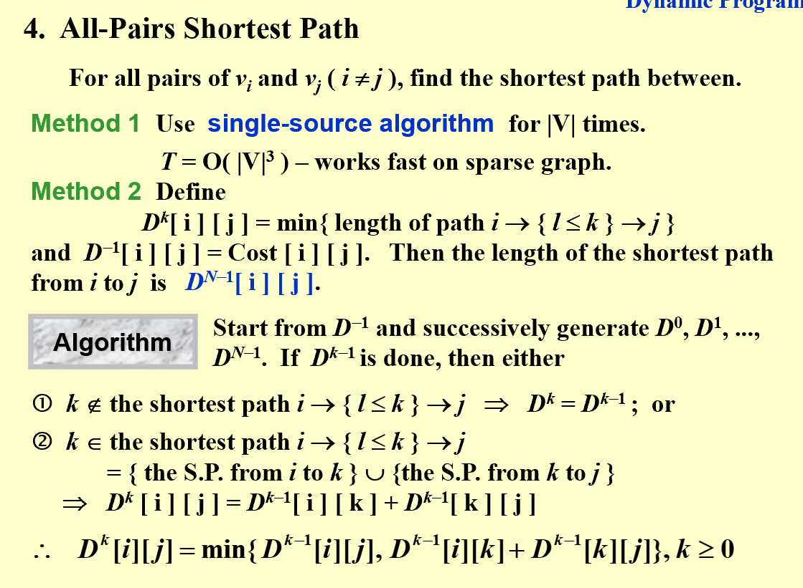
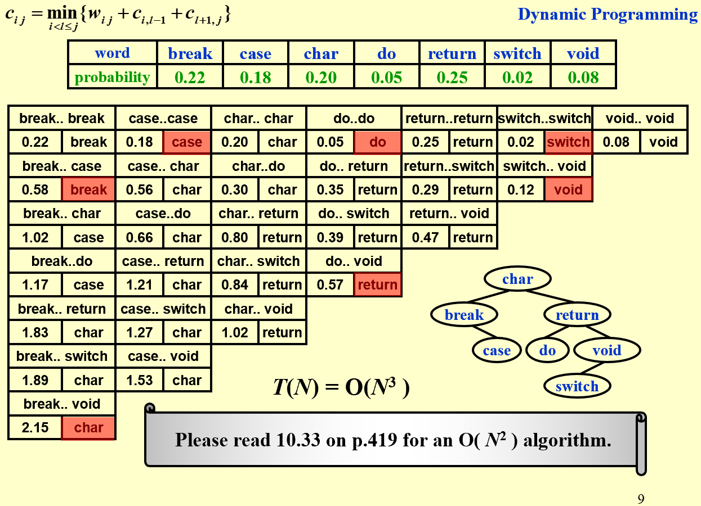

# Advanced Data Structure
## Dynamic Programming
> Solve sub-problems just once and save answers in a table
> Use a **table** instead of **recursion**

### example 1 Fibonacci Number

### example 2 Ordering Matrix Multiplications

### example 3 Optimal Binary Search Tree

### example 4 All-Pairs Shortest Path

