# 计算机组成
## Chapter2 Instructions

### 2.1 Introduction
> *To command a computer’s hardware, you must speak its language. The words 
of a computer’s language are called instructions, and its vocabulary is called an 
instruction set. In this chapter, you will see the instruction set of a real computer, both in the form written by people and in the form read by the computer. We 
introduce instructions in a top-down fashion.* 
**...**

### 2.2 Operation of the Computer Hardware

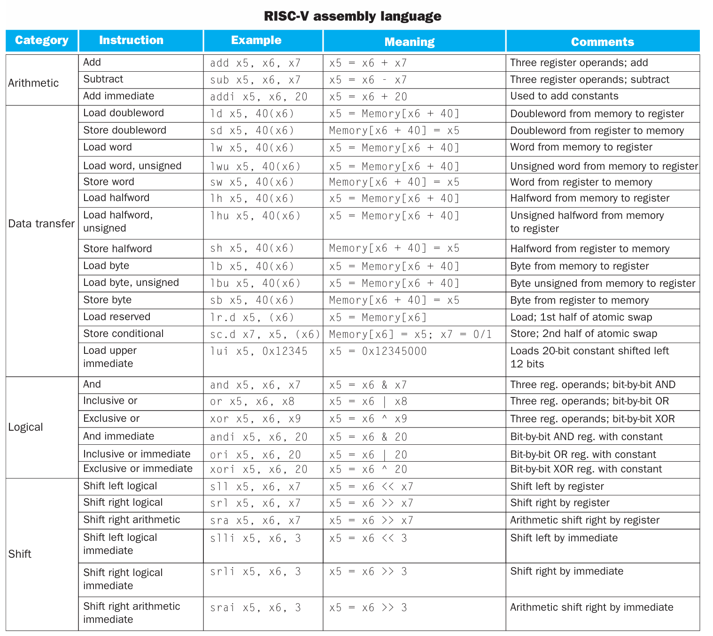       

一条指令的格式一般是 `[operation] [operand] [operand] [operand]`

**Design Principle Simplicity favors regularity**

### 2.3 Operands of the Computer Hardware

#### arithmetic operands
一条算术指令的 operand 只能来自于 `register`

!!! note
    RISC-V architecture 提供 32 个数据寄存器，分别命名为 x0 ~ x31 ，每个寄存器的大小是 64 位。在 RISC-V architecture 中，一个 word 为 32 位，一个 doubleword 为 64 位。这些寄存器中的一部分有专门的用途，我们稍后对其进行讨论。

为什么只有32个？ **Design Principle: Smaller is faster.**

#### memory operands
*As explained above, arithmetic operations occur only on registers in RISC-V 
instructions; thus, RISC-V must include instructions that transfer data between 
memory and registers. Such instructions are called data transfer instructions.  
To access a word or doubleword in memory, the instruction must supply the 
memory address. Memory is just a large, single-dimensional array, with the 
address acting as the index to that array, starting at 0.*

!!! note
    The data transfer instruction that copies data from memory to a register is traditionally called load. The format of the load instruction is the name of the operation followed by the register to be loaded, then register and a constant used to access memory. The sum of the constant portion of the instruction and the contents of the second register forms the memory address. The real RISC-V name for this instruction is ld, standing for load doubleword 

    The instruction complementary to load is traditionally called store; it copies data from a register to memory. The format of a store is similar to that of a load: the name of the operation, followed by the register to be stored, then the base register, and finally the offset to select the array element. Once again, the RISC-V address is specified in part by a constant and in part by the contents of a register. The actual RISC-V name is sd, standing for store doubleword

####  Constant or Immediate Operands

### 2.4 Representing Numbers in the computer

### 2.5 Representing Instructions in the computer

- R type (for register)
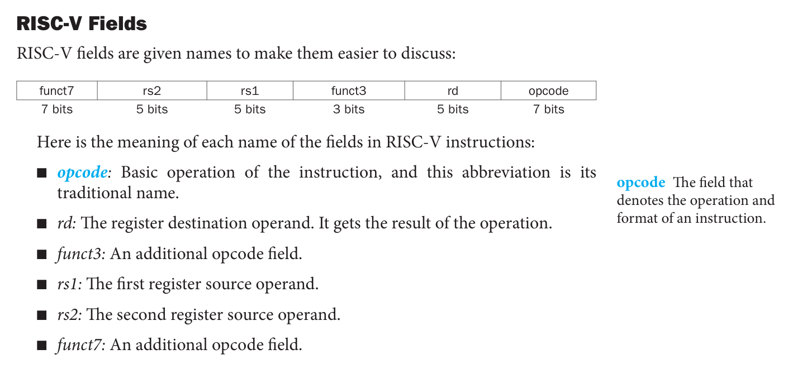

- I type (with constant)
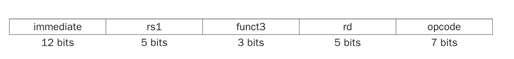
用于 使用立即数的算术运算、`ld`类

PS：
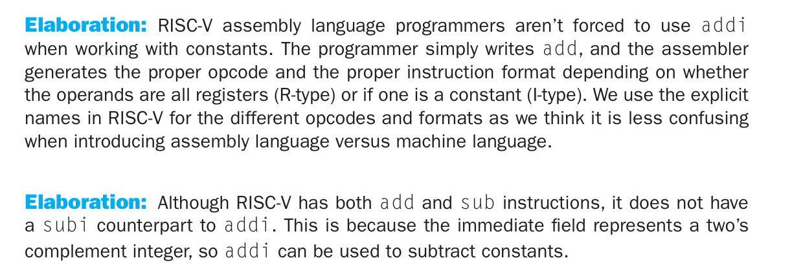

- S type (for `sd`类)
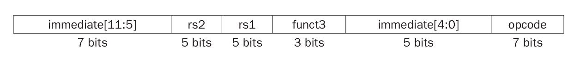

计算机会根据最低位的 opcode 分辨当前指令的类型

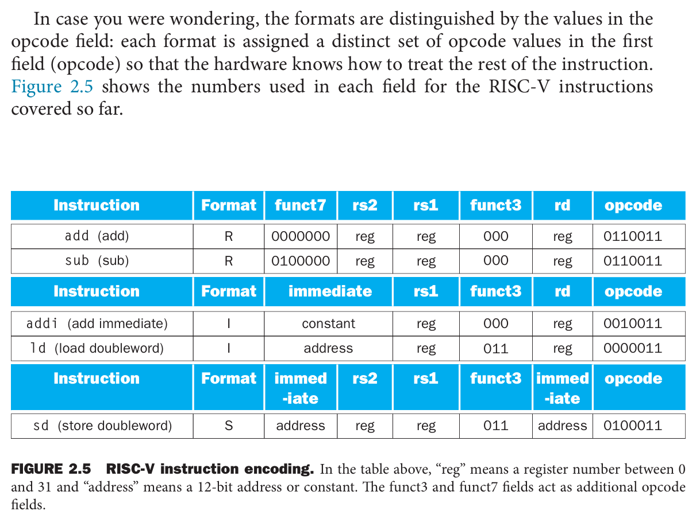

### 2.6 Logical operation
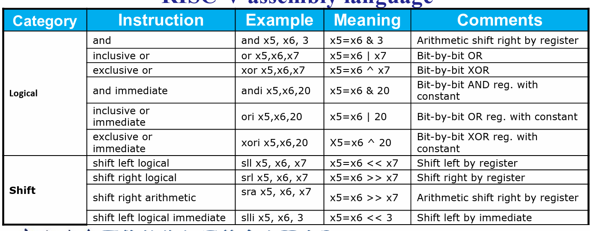

### Instructions for making decisions

#### Branch: If-else & Loop
two decision-making instructions: (*branch if eual and branch if not equal*)
`beq rs1, rs2, L1` and `bne rs1, rs2, L1` 等

!!! note "Bounds Check Shortcut"
    `bgeu x20, x11, IndexOutOfBound`    //  if x20 >= x11 or x20 < 0, goto IndexOutOfBounds
    因为负数使用补码表示的特殊性，可以用无符号数的比较，对一个数组的 index 进行 out-of-bounds check

branch指令经常和 `slt` 指令合用
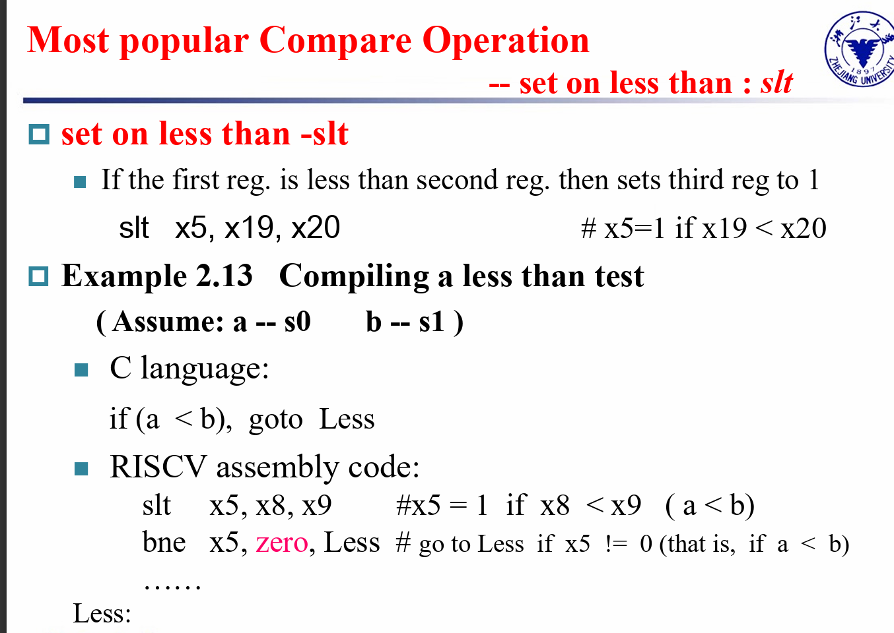

#### Case/Switch

### Procedures
#### What is and what is not preserved across a procedure call? and how?
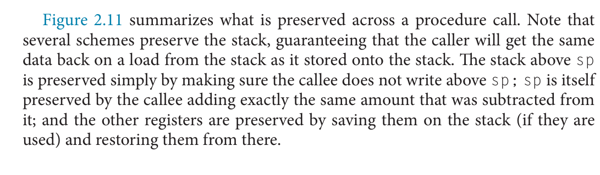
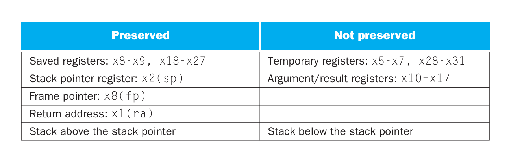

#### Memory Layout
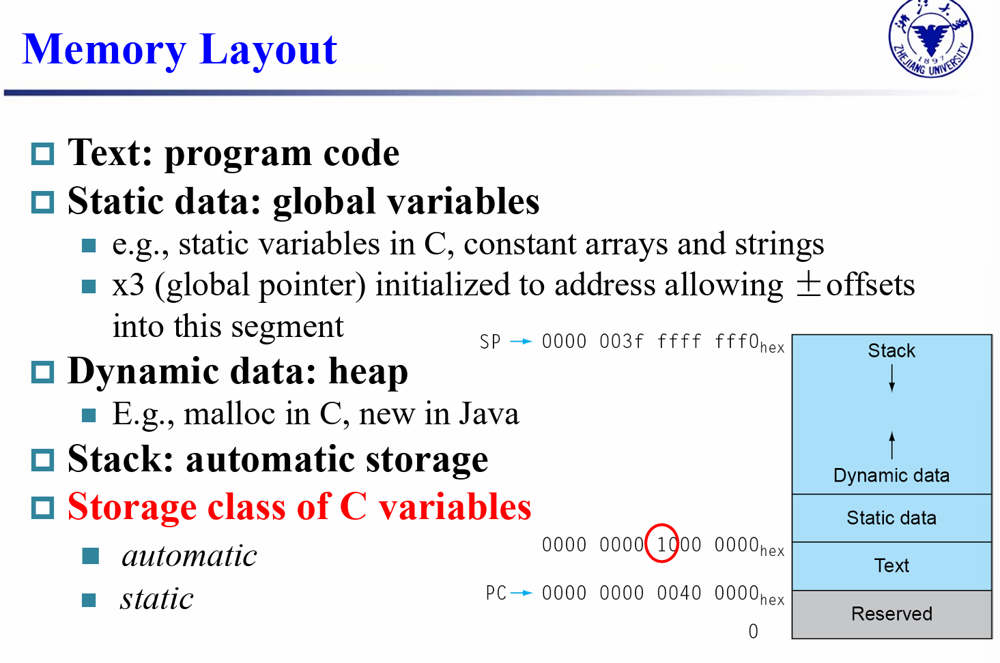
注意堆栈和堆都属于 Dynamic Data区

#### Tips 
leaf procedure(没有调用其他函数的块)，可以任意使用 temporary register

#### Branch Addressing & Jump Addressing
指令中存放的只有 11 ([12:1]) 位, 实际跳转地址时还要将所加立即数 乘 2

#### Disassembly
