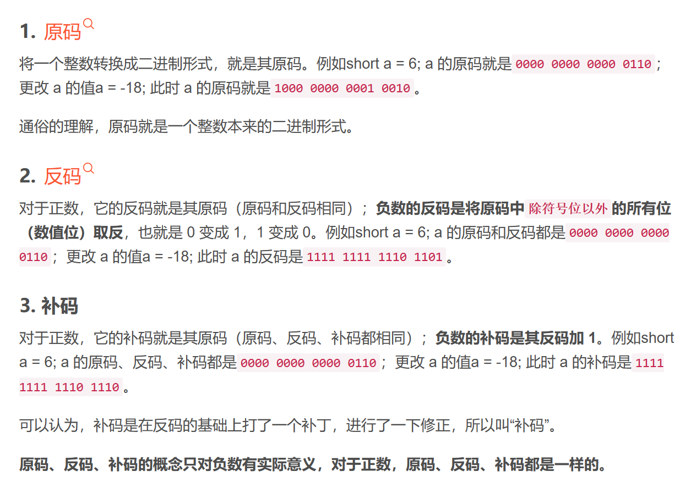
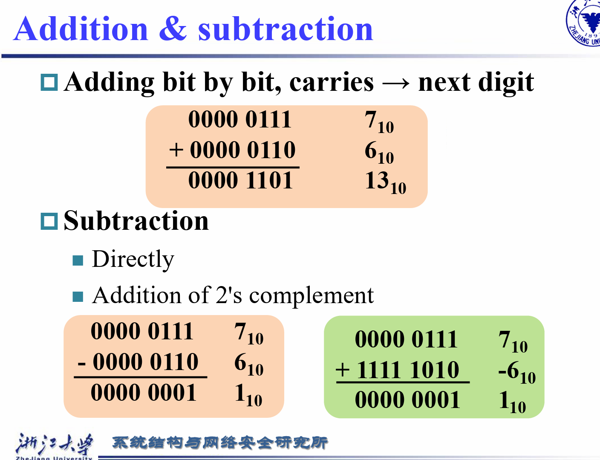
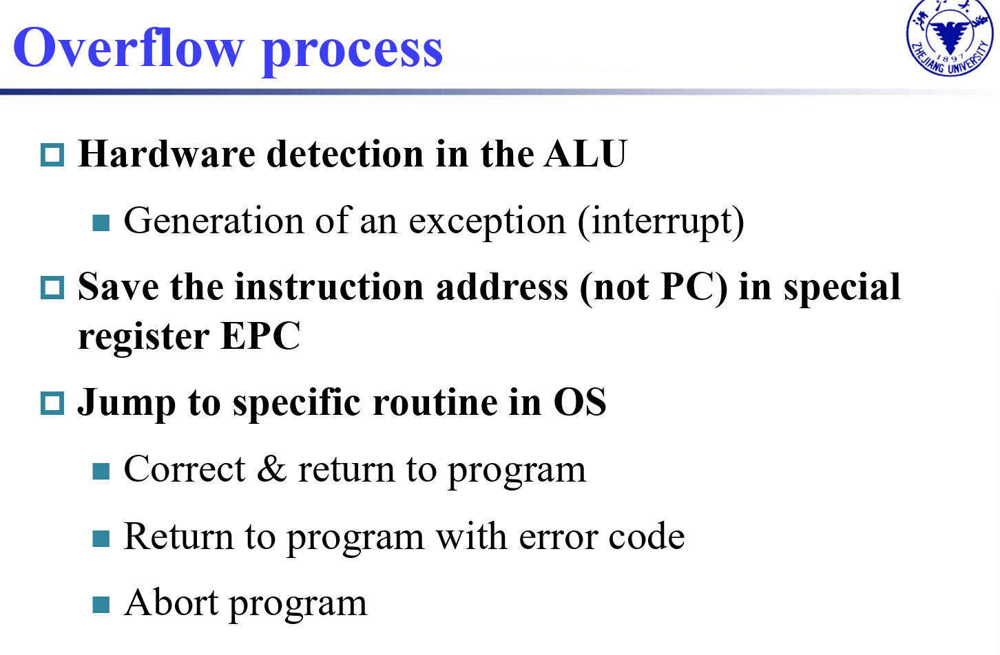
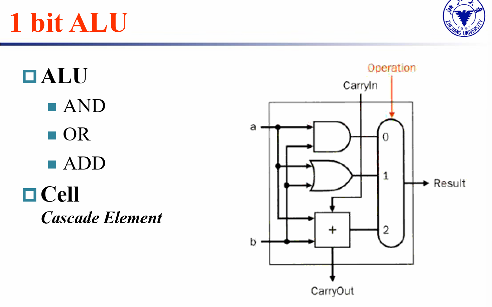

# 计算机组成
## Chapter3 Arithmetic for Computer

### Numbers Representations
!!! note
    整数：
    - unsigned
    - signed
    - one's complement: n-bits ---> $[-2^{n-1}-1, 2^{n-1}-1]$
    - two's complement: n-bits ---> $[-2^{n-1}, 2^{n-1}-1]$

### Arithmetic
#### 整数运算
##### 整数在计算机中的表示形式、运算原理
!!! 回顾
反码、补码、原码是针对有符号数提出的，使有符号和无符号数运算方式相同

!!! 
    
    怎么发现 Overflow ?
    - Double sign-bits:     符号位 和 符号位前一位(进位)
    怎么解决 Overflow?
    
##### Addition & Substraction
!!! note
    !!! half adder
    
    !!! full adder
    
    !!! Carry look-ahead adder (CLA)
    上面我们实现的全加器为**Ripple Carry Adder(RCA)**,若要使它拓展为n位数的运算，delay也会扩大n倍(串行逻辑)；显然，这种实现方式比较慢
    那么如何加速呢？
    课本指出，RCA 缓慢的重要原因是后一个 adder 需要等前一个 adder 的 carry 结果。那么考虑能不能找到Carry的一个新方程，摆脱对前面结果的依赖
    [参考](https://zhuanlan.zhihu.com/p/579055858)
    **4位RCA：2*4+1=9级时延**
    **4位CLA： 1+2+1=4级时延**
    **16位串行CLA（4\*4位CLA）1+2*4+1=10级时延**
    **16级组间超前CLA(输入—PG—PGM—CLU—CLU—异或门—输出)：1+2+2+2+1=8级时延**
    !!! 1 bit ALU
    
    !!! Extended 1 bit ALU -- Substraction
    
    !!! Extended 1 bit ALU -- comparison
#### 浮点数运算