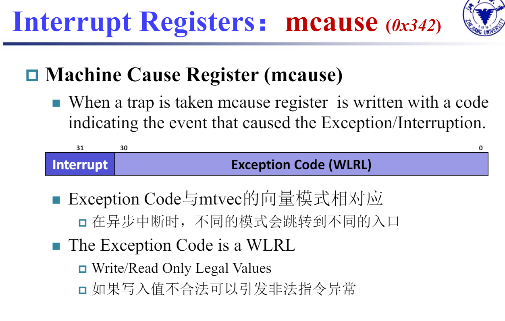
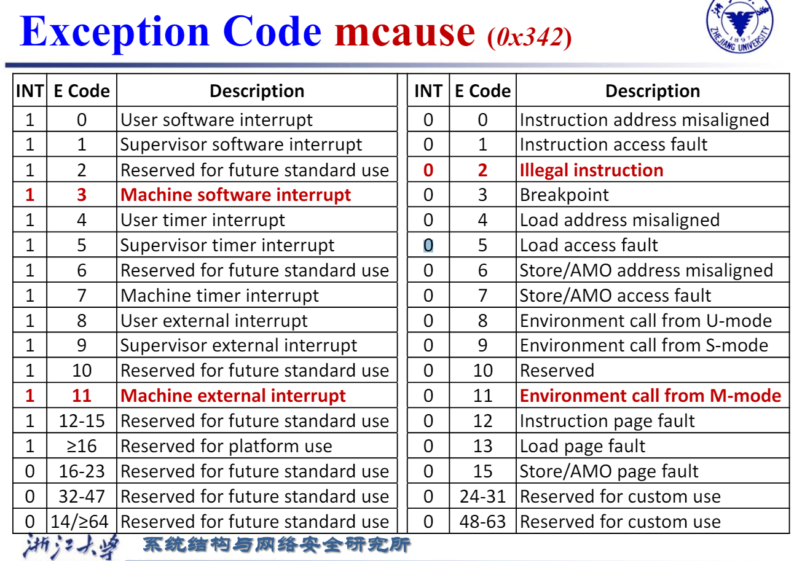
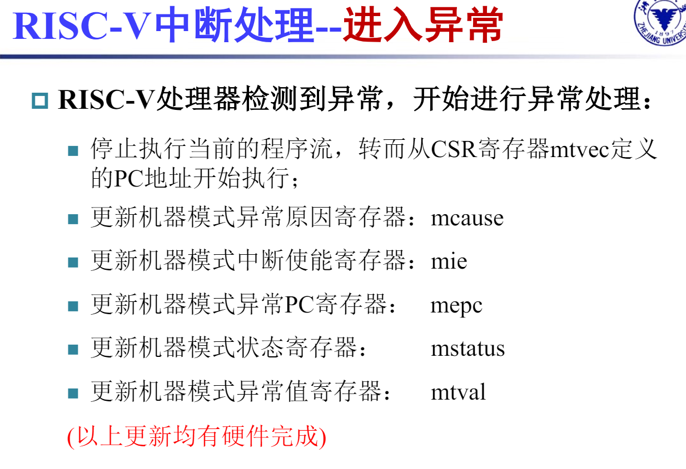
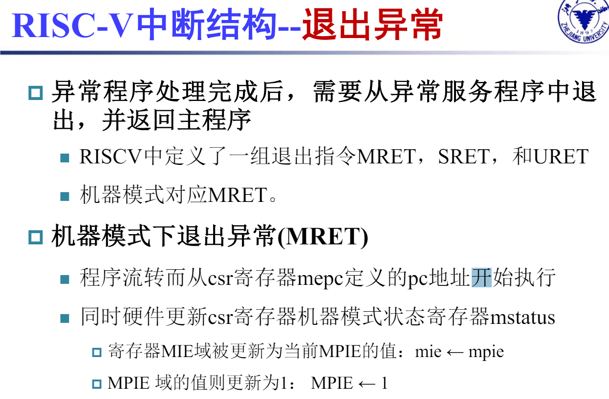

# single cycle CPU Exception
> Exception (广义上的异常) 分为 Interrupt （外部中断） 和 Exception （系统内的异常，狭义上的）

## Related Hardware
### Interrupt Registers: mcause

> 发生异常时，该寄存器会被写入对应异常的原因的编码

### Interrupt Registers: mie/mip

## Procedure

# Pipline CPU Exception
