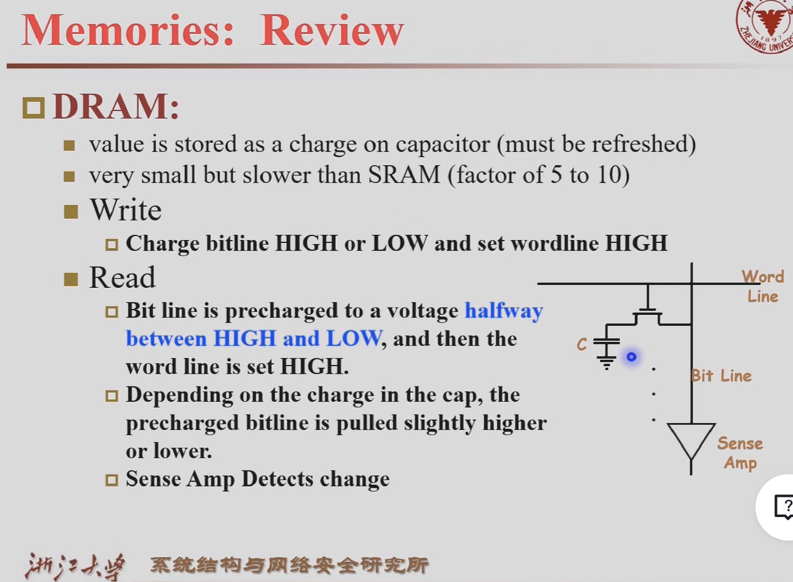
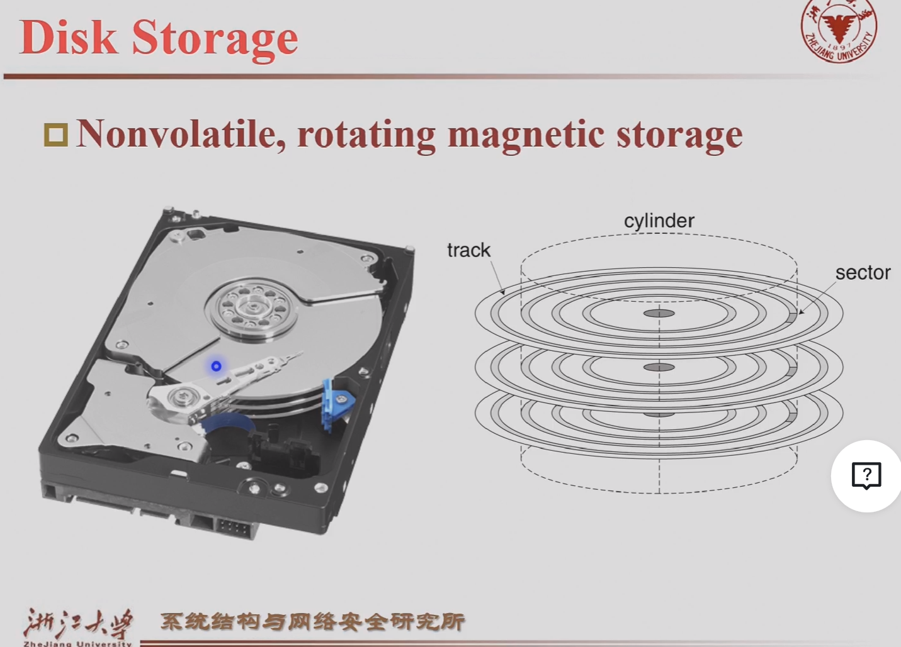

# Memory
## Memory technologies
### SRAM
> 一对反向器，两个开关
### DRAM

### flash memory
1. 非易失 nonvolatile
2. 应用于固态硬盘
### Disk storage
1. Nonvolatile, rotating magnetic storage

## Memory Hierarchy
### Temporal locality
### Spatial locality

