# DataBase System
## intro
上不明白
## Week 1 Introduction
### What Is a Database and DBMS?
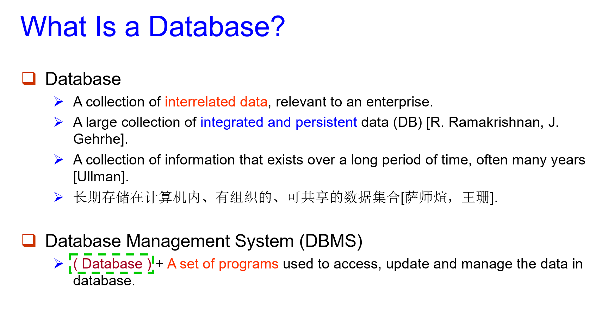
### Architecture of DataBase System 1
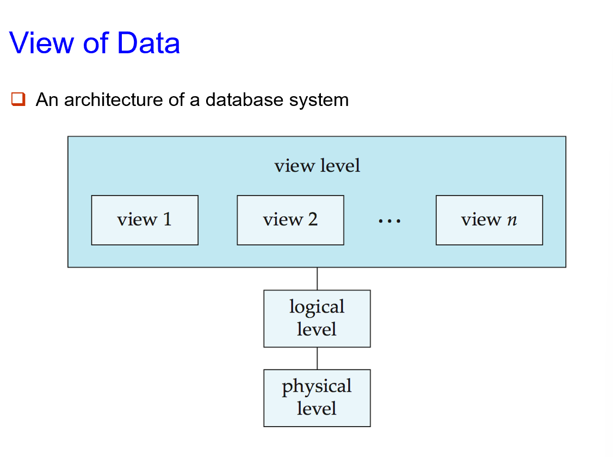
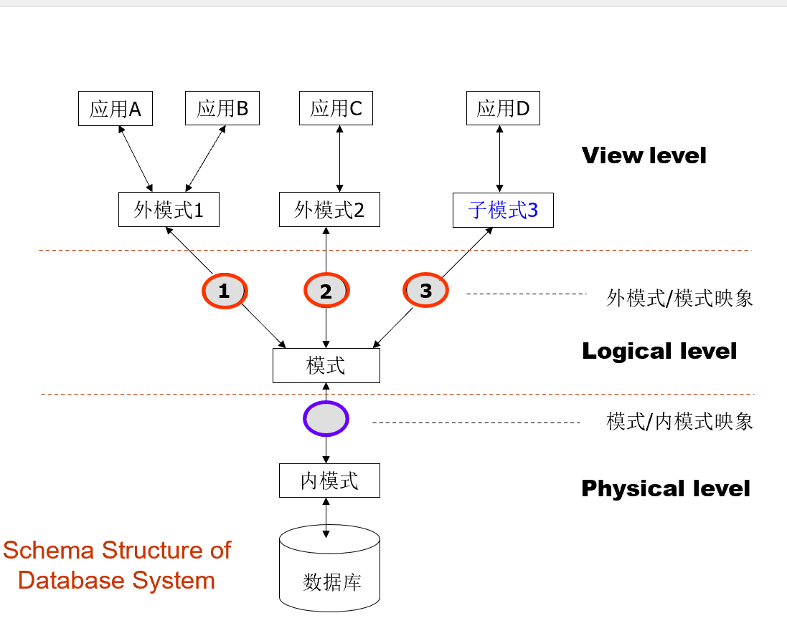

### Database Language
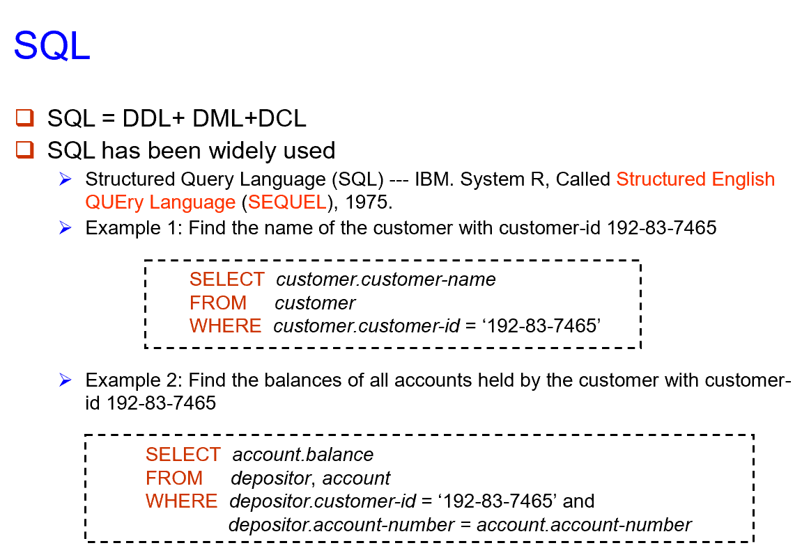

### Database Design
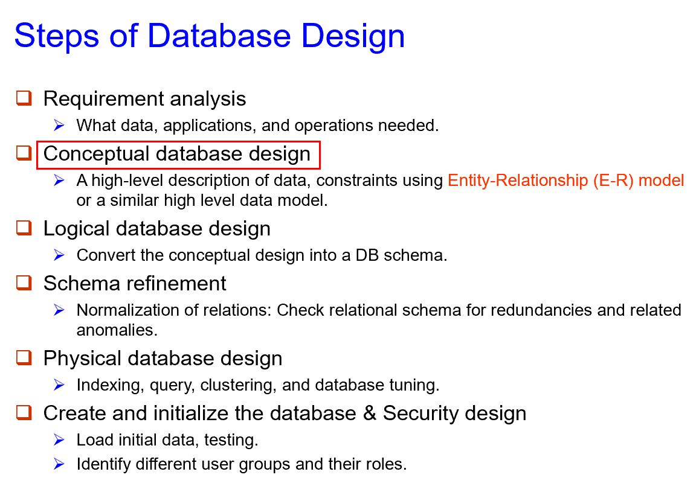
 !!! attention
    这里PPT上 p46-p50 有涉及从E-R图，到Relation Model Schema，再到 view level/ Logical level的数据库设计过程，有助于理解前面乱七八糟的一堆概念

### Database Users and Administrators
> DB 产业链上的各个生态位

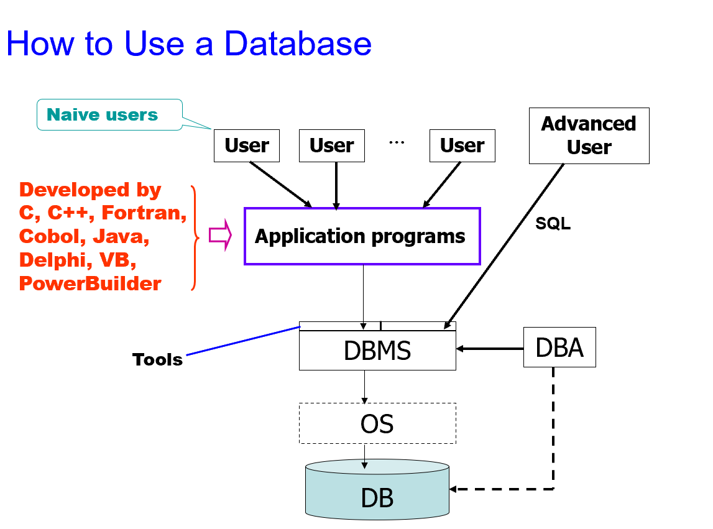
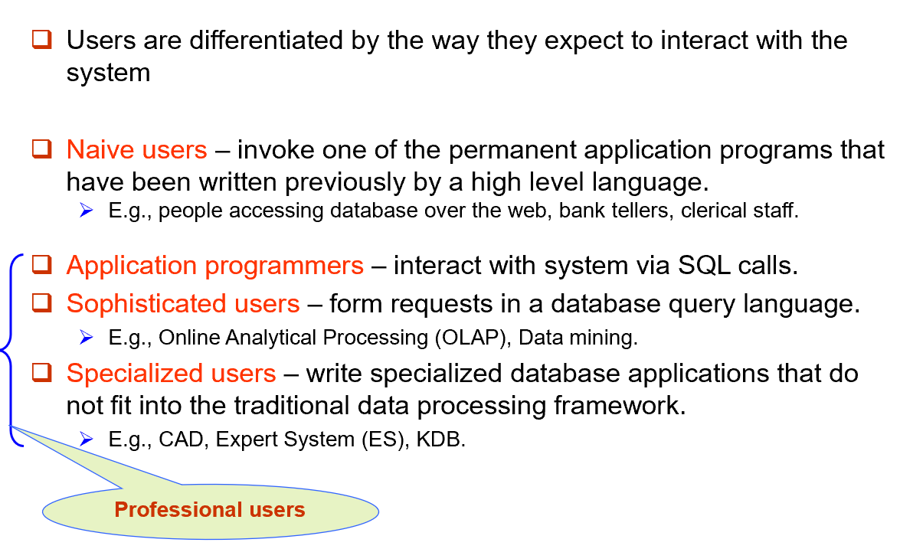

### Transaction Management
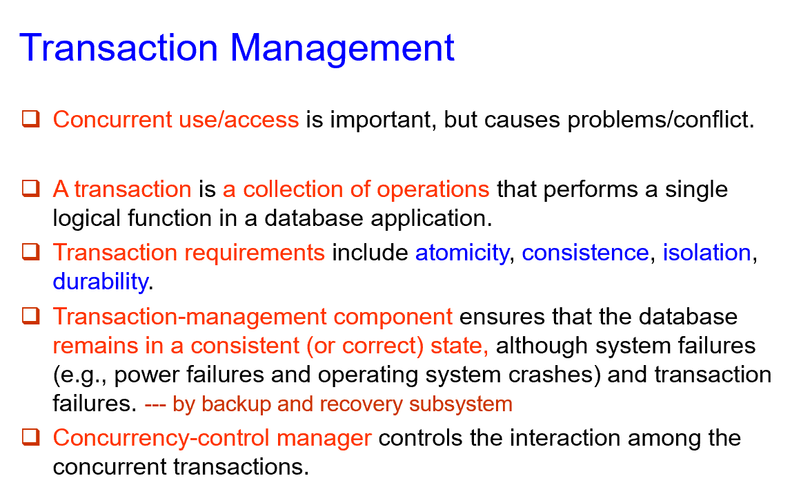

### Architecture of DataBase System 2
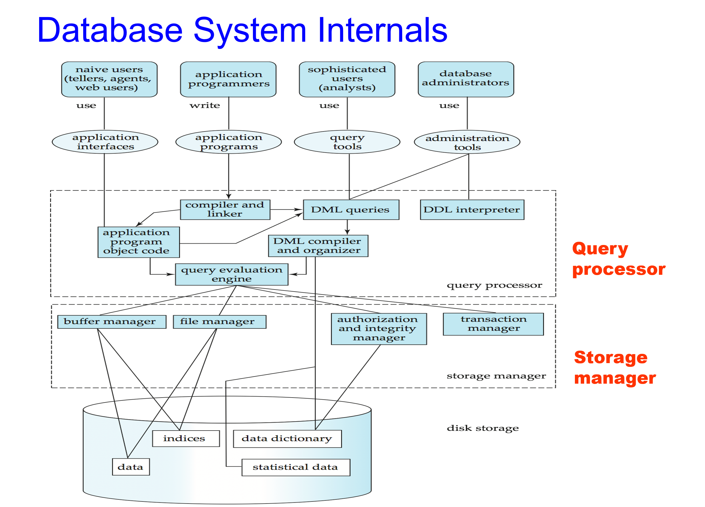
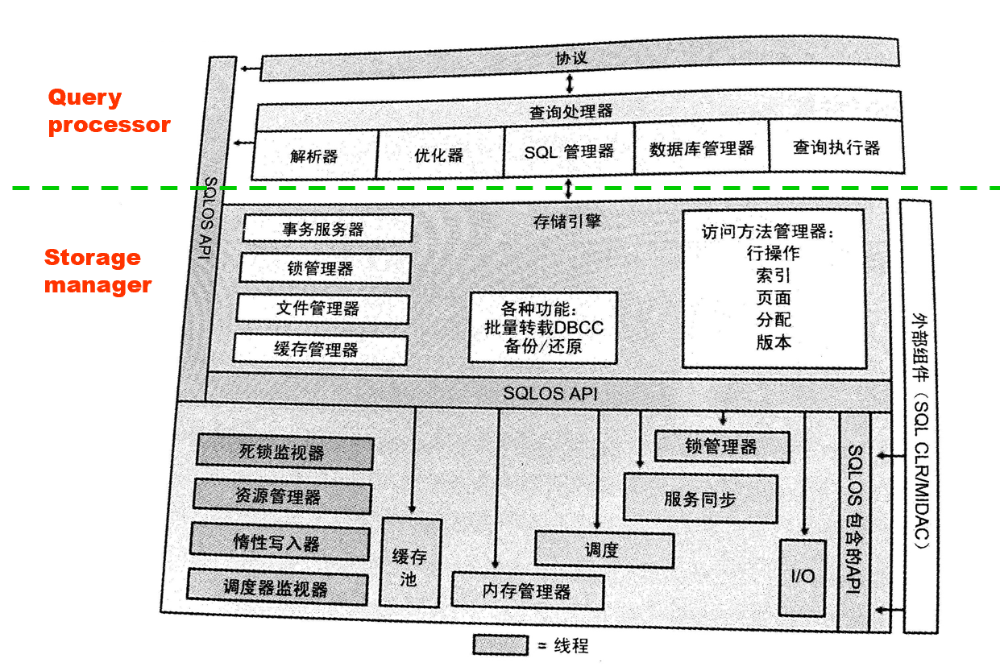
> Database System 与 User
> 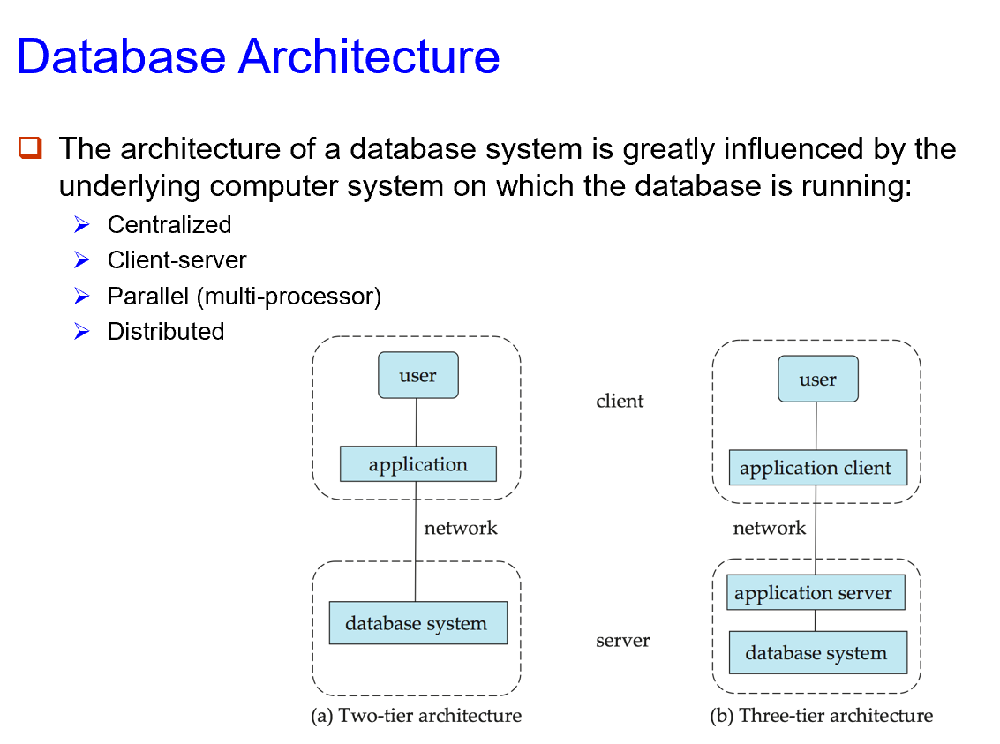

### Summary of Lecture 1
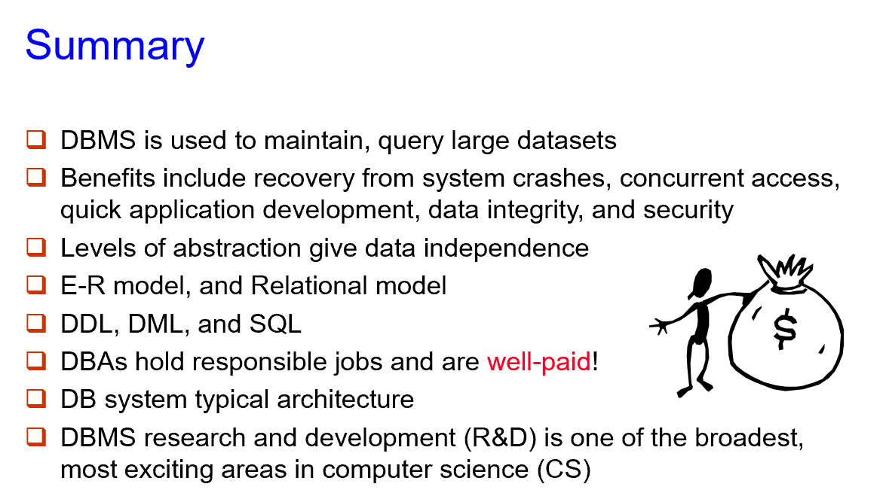
